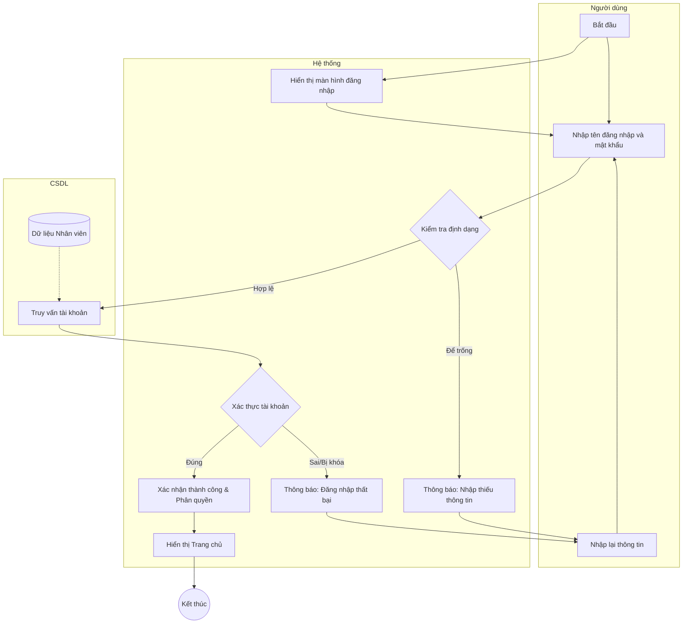

# Đặc tả Use-case: UC01 - Đăng nhập

| Thành phần | Nội dung |
|:---|:---|
| **Tên Use-case** | **Đăng nhập** |
| **Mô tả Use-case** | Hệ thống cho phép người dùng truy cập vào các chức năng quản lý bằng tài khoản đã được cấp phát để làm việc. |
| **Actors** | Tất cả nhân viên |
| **Tiền điều kiện** | Người dùng đã có tài khoản và mật khẩu hợp lệ trong hệ thống. |
| **Hậu điều kiện** | Người dùng truy cập thành công vào giao diện chính tương ứng với quyền hạn của mình. |
| **Luồng sự kiện chính** | 1. Người dùng nhập tên đăng nhập và mật khẩu vào màn hình đăng nhập. 2. Người dùng nhấn nút "Đăng nhập". 3. Hệ thống kiểm tra tính hợp lệ của thông tin đăng nhập. 4. Hệ thống xác nhận thông tin đúng và kiểm tra quyền hạn của tài khoản. 5. Hệ thống hiển thị giao diện trang chủ phù hợp với vai trò của người dùng. |
| **Luồng sự kiện phụ** | 3a. Nếu thông tin nhập vào chưa đầy đủ, hệ thống hiển thị thông báo "Vui lòng nhập đầy đủ thông tin". |
| **Luồng sự kiện lỗi hoặc ngoại lệ** | - Người dùng thoát khỏi màn hình đăng nhập, Use-case kết thúc. - Nếu thông tin đăng nhập sai hoặc tài khoản bị khóa, hệ thống hiển thị thông báo "Đăng nhập thất bại" và yêu cầu nhập lại. |

## Activity Diagram (Sơ đồ hoạt động)

