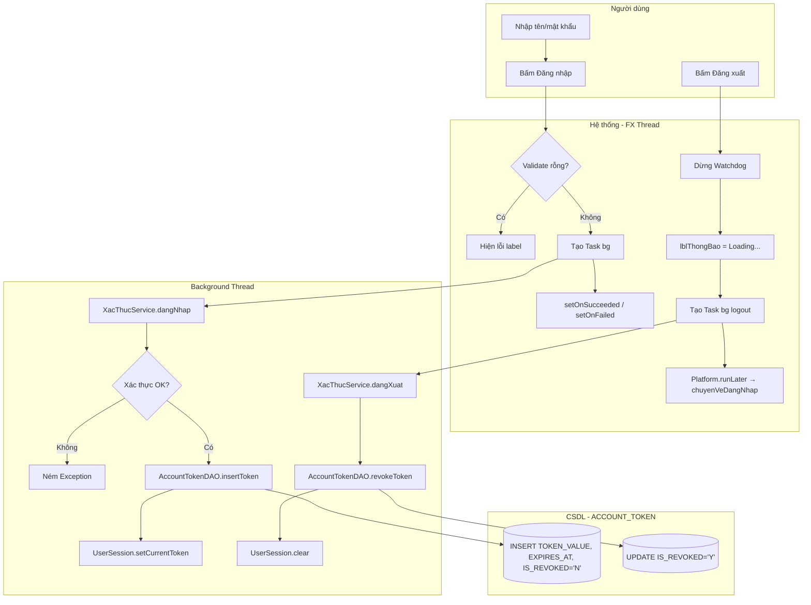

# UC01 — Đăng nhập (Login)

> **Liên quan:** Xem [UC02_DangXuat.md](UC02_DangXuat.md) cho luồng đăng xuất.

| Thành phần | Nội dung |
|:---|:---|
| **Tên Use-case** | Đăng nhập |
| **Mô tả** | Nhân viên xác thực thông tin, hệ thống tạo token trong bảng `ACCOUNT_TOKEN` (hiệu lực 12h) và khởi động Watchdog giám sát phiên. |
| **Actors** | Nhân viên (mọi vai trò) |
| **Tiền điều kiện** | Tài khoản tồn tại trong `TAIKHOAN`, trạng thái hoạt động (`TRANGTHAITK = 1`, `TRANGTHAILAMVIEC = 1`) |
| **Hậu điều kiện** | Bản ghi `ACCOUNT_TOKEN` được tạo, `UserSession.currentToken` cập nhật, `SessionContext.AuthSession` active, Watchdog chạy |

## Luồng sự kiện chính — Đăng nhập

1. Nhân viên nhập tên đăng nhập và mật khẩu → bấm **Đăng nhập**.
2. `DangNhapViewFXMLController.onDangNhap()` tạo `Task<NhanVienDTO>` chạy background.
3. `XacThucService.dangNhap()` kiểm tra:
   - Tên đăng nhập & mật khẩu không rỗng.
   - `NHANVIEN.TRANGTHAILAMVIEC = 1` và `TAIKHOAN.TRANGTHAITK = 1`.
   - bcrypt verify mật khẩu.
   - Lấy phân quyền hợp nhất qua `PhanQuyenDAO`.
4. Tạo `SessionContext.AuthSession` (in-memory).
5. Resolve `MATAIKHOAN` từ `NhanVienDAO.layMaTaiKhoan()`.
6. `AccountTokenDAO.thuHoiToanBoTheoTaiKhoan()` — dọn token cũ.
7. `AccountTokenDAO.insertToken()` — tạo `ACCOUNT_TOKEN` mới, hết hạn +1 ngày (≥12h ca dài nhất).
8. Lưu `token` vào `UserSession.currentToken` và `NhanVienDTO` vào `UserSession.currentUser`.
9. UI chuyển về `MainMenuView` (hoặc `MoCaView` nếu là Thu ngân chưa mở ca).
10. `SessionWatchdogService` bắt đầu giám sát mỗi 30 giây.

## Luồng sự kiện chính — Đăng xuất

1. Nhân viên bấm **Đăng xuất** trên sidebar.
2. `MainMenuViewFXMLController.onDangXuat()`:
   - Dừng Watchdog ngay lập tức.
   - Hiển thị loading `lblThongBao = "Đang đăng xuất..."`.
   - Tạo `Task<Void>` chạy background → `XacThucService.dangXuat()`.
3. `XacThucService.dangXuat()`:
   - `AccountTokenDAO.revokeToken(token)` → `UPDATE ACCOUNT_TOKEN SET IS_REVOKED='Y' WHERE TOKEN_VALUE=?`
   - `UserSession.clear()` + `SessionContext.clear()`.
4. `Platform.runLater()` → `chuyenVeDangNhap()` load lại `DangNhapView.fxml`.

## Luồng lỗi

| Bước | Lỗi | Xử lý |
|:---|:---|:---|
| 3 | Sai tên/mật khẩu | `NgoaiLeXacThuc.THONG_TIN_DANG_NHAP_SAI` → hiển thị label lỗi |
| 3 | Tài khoản bị khóa | `NgoaiLeXacThuc.TAI_KHOAN_BI_KHOA` → hiển thị label lỗi |
| 7 | DB lỗi insertToken | Exception propagate → View hiển thị lỗi hệ thống |
| 3 (Logout) | DB lỗi revokeToken | Vẫn xóa session local + về màn đăng nhập (fail-safe) |

## Luồng Watchdog

- Mỗi 30s: `AccountTokenDAO.timTheoGiaTri(token)` → check `IS_REVOKED = 'N'` và `EXPIRES_AT >= SYSDATE`.
- Nếu token bị revoke từ ngoài hoặc hết hạn: `SessionContext.clear()` + `UserSession.clear()` + Alert + về màn đăng nhập.

## Ghi chú kỹ thuật

| Thành phần | Vai trò |
|:---|:---|
| `AccountTokenDTO` | DTO ánh xạ `ACCOUNT_TOKEN`, dùng `LocalDate` (cột DATE) |
| `AccountTokenDAO` | `insertToken()`, `revokeToken()`, `timTheoGiaTri()`, `thuHoiToanBoTheoTaiKhoan()` |
| `XacThucService` | Orchestrate login/logout, dùng `accountTokenDAO` thay `sessionDAO` |
| `SessionWatchdogService` | Check `accountTokenDAO.timTheoGiaTri()` mỗi 30s |
| `UserSession` | Singleton in-memory, giữ `currentToken` + `currentUser` |
| `SessionContext` | Singleton in-memory, giữ `AuthSession` (quyền + vai trò) |
| `NhanVienDAO.layMaTaiKhoan()` | Resolve `MATAIKHOAN` từ `MANV` để tạo FK đúng |
