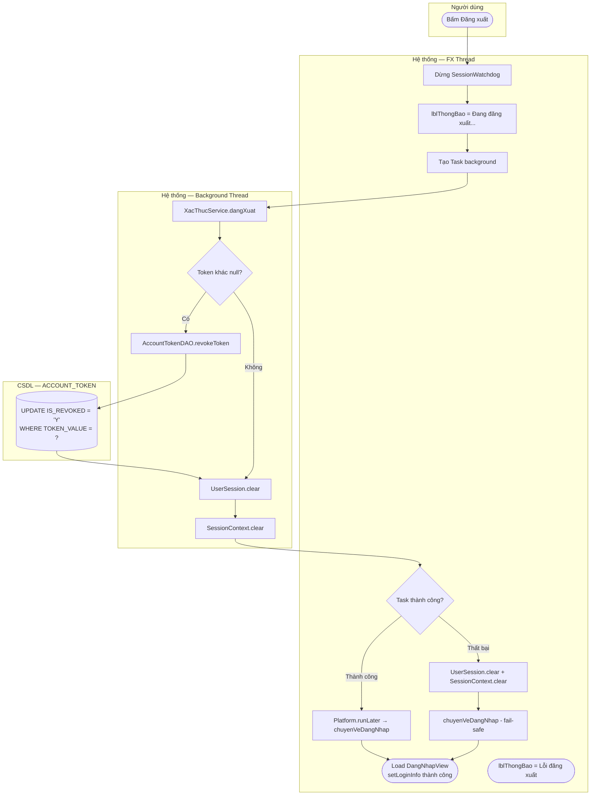

# UC02 — Đăng xuất (Logout)

| Thành phần | Nội dung |
|:---|:---|
| **Tên Use-case** | Đăng xuất |
| **Mô tả Use-case** | Nhân viên kết thúc phiên làm việc. Hệ thống thu hồi token trong `ACCOUNT_TOKEN` (`IS_REVOKED = 'Y'`), xóa dữ liệu phiên khỏi bộ nhớ, và điều hướng về màn hình đăng nhập. |
| **Actors** | Nhân viên (mọi vai trò đang đăng nhập) |
| **Tiền điều kiện** | Nhân viên đã đăng nhập, `UserSession.currentToken` khác null, `SessionContext` đang có phiên hợp lệ |
| **Hậu điều kiện** | `ACCOUNT_TOKEN.IS_REVOKED = 'Y'`, `UserSession` và `SessionContext` đã bị xóa, ứng dụng trở về `DangNhapView` |

---

## Luồng sự kiện chính

| Bước | Actor | Hành động |
|:-----|:------|:----------|
| 1 | Nhân viên | Bấm nút **Đăng xuất** trên sidebar |
| 2 | Hệ thống (FX Thread) | `MainMenuViewFXMLController.onDangXuat()` dừng `SessionWatchdogService` ngay lập tức |
| 3 | Hệ thống (FX Thread) | `lblThongBao = "Đang đăng xuất..."` — hiển thị trạng thái loading |
| 4 | Hệ thống (FX Thread) | Tạo `Task<Void>` và khởi chạy trên background thread |
| 5 | Hệ thống (Background Thread) | `XacThucService.dangXuat()` lấy `token` từ `UserSession.getCurrentToken()` |
| 6 | Hệ thống (Background Thread) | `AccountTokenDAO.revokeToken(token)` → `UPDATE ACCOUNT_TOKEN SET IS_REVOKED = 'Y' WHERE TOKEN_VALUE = ?` |
| 7 | Hệ thống (Background Thread) | `UserSession.clear()` + `SessionContext.clear()` — xóa toàn bộ phiên in-memory |
| 8 | Hệ thống (FX Thread) | `Platform.runLater()` → `chuyenVeDangNhap()` |
| 9 | Hệ thống (FX Thread) | Load `DangNhapView.fxml`, gọi `setLoginInfo("Bạn đã đăng xuất thành công.")` |
| 10 | Hệ thống (FX Thread) | `Stage` chuyển cảnh về màn hình đăng nhập |

---

## Luồng sự kiện phụ

**2a — Watchdog phát hiện token bị revoke từ bên ngoài (force logout):**

| Bước | Hành động |
|:-----|:----------|
| 2a.1 | `SessionWatchdogService` check mỗi 30s → `AccountTokenDAO.timTheoGiaTri(token)` trả về `IS_REVOKED = 'Y'` hoặc `null` |
| 2a.2 | `succeeded()` callback: `Platform.runLater()` → `SessionContext.clear()` + `UserSession.clear()` |
| 2a.3 | Hiện `Alert.WARNING` — "Phiên đăng nhập đã bị thu hồi..." |
| 2a.4 | Watchdog tự hủy (`cancel()`), load `DangNhapView.fxml` |

---

## Luồng sự kiện lỗi

| Bước lỗi | Mô tả | Xử lý |
|:---------|:------|:------|
| 6 (DB lỗi) | `AccountTokenDAO.revokeToken()` ném exception (mất kết nối) | `taskDangXuat.setOnFailed()` vẫn gọi `UserSession.clear()` + `SessionContext.clear()` + `chuyenVeDangNhap()` (**fail-safe**) |
| 5 (token null) | `UserSession.getCurrentToken()` = null (session lỗi) | `XacThucService.dangXuat()` bỏ qua bước revoke DB, vẫn xóa session local |
| 9 (FXML lỗi) | Không tìm thấy `DangNhapView.fxml` | `lblThongBao` hiện thông báo lỗi, ứng dụng không treo |

---

## Activity Diagram

---

## Mapping kỹ thuật

| Thành phần | Vai trò trong UC02 |
|:-----------|:-------------------|
| `MainMenuViewFXMLController.onDangXuat()` | Entry point — dừng watchdog, hiển thị loading, spawn Task |
| `MainMenuViewFXMLController.chuyenVeDangNhap()` | Điều hướng về màn đăng nhập, chỉ gọi trên FX Thread |
| `XacThucService.dangXuat()` | Orchestrate: revoke DB token → clear memory session |
| `AccountTokenDAO.revokeToken(token)` | `UPDATE ACCOUNT_TOKEN SET IS_REVOKED='Y'` — JDBC auto-commit |
| `UserSession.clear()` | Xóa `currentUser` + `currentToken` khỏi static singleton |
| `SessionContext.clear()` | Xóa `AuthSession` + reset `maCa` + `caoDangMo = false` |
| `SessionWatchdogService` | Tự hủy khi nhân viên chủ động đăng xuất (`dungWatchdog()`) |
| `DangNhapViewFXMLController.setLoginInfo()` | Hiển thị thông báo "Đăng xuất thành công" trên màn đăng nhập |

---

> **Ghi chú bảo mật:** `IS_REVOKED = 'Y'` được ghi vào DB ngay cả khi nhân viên đăng xuất chủ động, đảm bảo mọi thiết bị đang giám sát token (Watchdog) sẽ phát hiện phiên đã kết thúc trong tối đa 30 giây.
