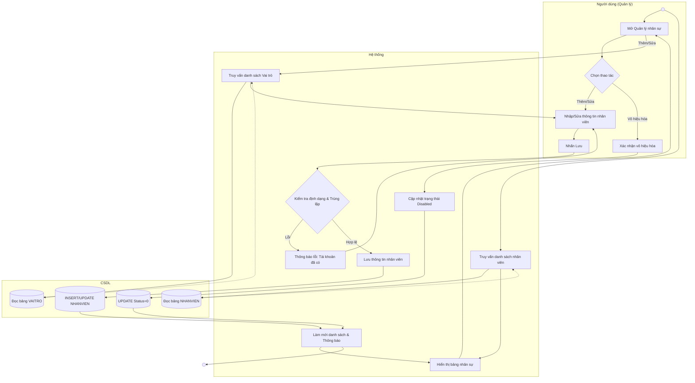

# Đặc tả Use-case: UC03 - Quản lý nhân sự

| Thành phần | Nội dung |
|:---|:---|
| **Tên Use-case** | **Quản lý nhân sự** |
| **Mô tả Use-case** | Cho phép người quản trị thêm mới nhân viên, cập nhật thông tin cá nhân hoặc vô hiệu hóa tài khoản của nhân viên trong hệ thống. |
| **Actors** | Quản trị viên, Quản lý cửa hàng |
| **Tiền điều kiện** | Người dùng đã đăng nhập với quyền quản trị. |
| **Hậu điều kiện** | Dữ liệu nhân sự được cập nhật đồng bộ trong CSDL. |
| **Luồng sự kiện chính** | 1. Người dùng mở màn hình "Quản lý nhân sự". 2. Hệ thống truy vấn CSDL và hiển thị danh sách nhân viên hiện tại. 3. **Nếu Thêm:** Người dùng nhấn "Thêm mới". Hệ thống load danh sách Vai trò từ bảng VAITRO. Người dùng nhập thông tin (Họ tên, SĐT, Tài khoản) và chọn Vai trò. 4. **Nếu Sửa:** Người dùng chọn nhân viên, hệ thống hiển thị thông tin hiện tại và danh sách Vai trò để thay đổi. 5. Hệ thống kiểm tra tính hợp lệ (không để trống, tài khoản không trùng). 6. Hệ thống thực hiện ghi dữ liệu vào bảng NHANVIEN. 7. Hệ thống làm mới danh sách và thông báo thành công. |
| **Luồng sự kiện phụ** | 3a. **Nếu Vô hiệu hóa:** Người dùng chọn nhân viên và nhấn "Vô hiệu hóa". Hệ thống cập nhật trạng thái hoạt động về 0. |
| **Luồng sự kiện lỗi hoặc ngoại lệ** | - Nếu tên tài khoản hoặc số điện thoại đã tồn tại, hệ thống báo lỗi (Popup) và yêu cầu nhập lại. - Nếu nhân viên đang có các giao dịch liên quan, hệ thống chặn việc xóa vĩnh viễn và gợi ý vô hiệu hóa tài khoản. |

## Activity Diagram (Sơ đồ hoạt động)

