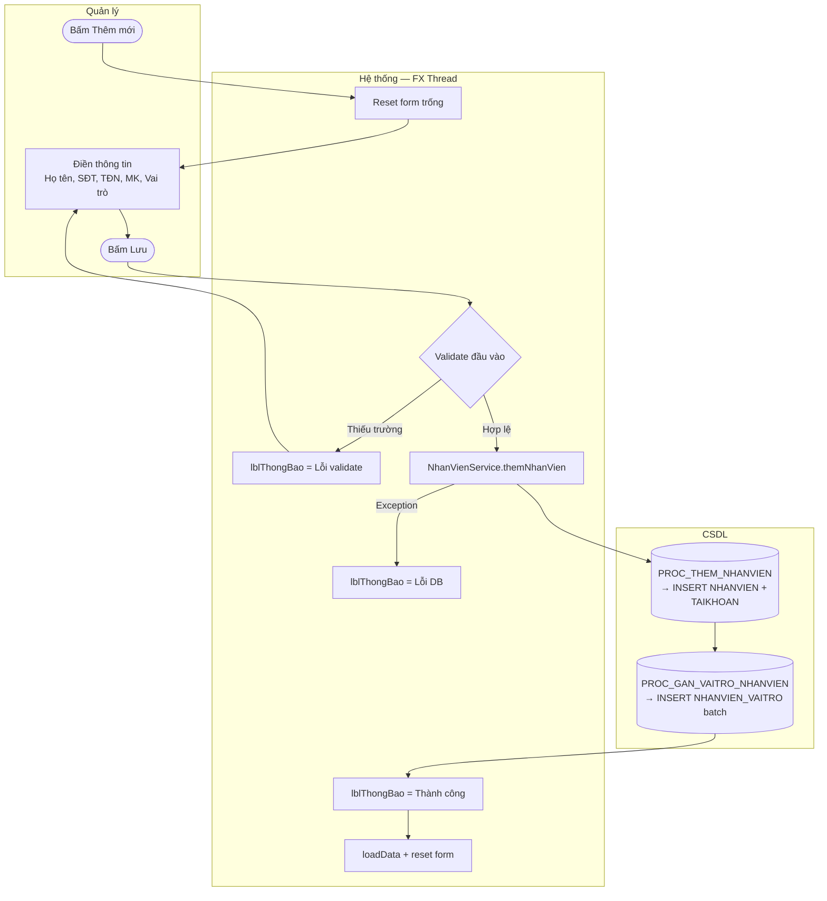

# UC04 — Thêm nhân sự

| Thành phần | Nội dung |
|:---|:---|
| **Tên Use-case** | Thêm nhân sự |
| **Mô tả Use-case** | Tạo mới hồ sơ nhân viên và cấp phát tài khoản đăng nhập hệ thống. Bao gồm gán vai trò ban đầu để kiểm soát phân quyền truy cập. |
| **Actors** | Quản lý |
| **Tiền điều kiện** | Đã đăng nhập với vai trò Quản lý. Màn hình `QuanLyNhanVienView` đang mở. |
| **Hậu điều kiện** | Bản ghi mới trong `NHANVIEN` + `TAIKHOAN` + `NHANVIEN_VAITRO` được tạo. Danh sách nhân viên được làm mới. |

---

## Luồng sự kiện chính

| Bước | Actor | Hành động |
|:-----|:------|:----------|
| 1 | Quản lý | Bấm **Thêm mới** — form trống xuất hiện bên phải |
| 2 | Hệ thống | `loadRoles()` truy vấn `VAITRO` và render danh sách CheckBox vai trò |
| 3 | Quản lý | Điền: Họ tên, SĐT, Tên đăng nhập, Mật khẩu; tích chọn ≥ 1 vai trò |
| 4 | Quản lý | Bấm **Lưu** |
| 5 | Hệ thống (View) | Validate: Họ tên không trống, Tên đăng nhập không trống, Mật khẩu không trống |
| 6 | Hệ thống (Service) | `NhanVienService.themNhanVien()` → `NhanVienDAO.themNhanVien()` |
| 7 | CSDL | `PROC_THEM_NHANVIEN(HoTen, NgaySinh, SDT, TenDangNhap, MatKhau, TrangThai) → MANV_OUT` |
| 8 | CSDL | `PROC_GAN_VAITRO_NHANVIEN(MANV, MAVAITRO)` cho từng vai trò đã chọn (batch) |
| 9 | Hệ thống | Hiển thị `lblThongBao = "✅ Tạo nhân viên thành công. Mã NV: X"` |
| 10 | Hệ thống | `loadData()` làm mới bảng, `onThemMoi()` reset form |

---

## Luồng sự kiện lỗi

| Lỗi | Xử lý |
|:----|:------|
| Họ tên để trống | `lblThongBao = "Vui lòng nhập Họ tên."` — dừng lại |
| Tên đăng nhập để trống | `lblThongBao = "Vui lòng nhập Tên đăng nhập."` — dừng lại |
| Mật khẩu để trống | `lblThongBao = "Mật khẩu không được để trống khi tạo mới."` — dừng lại |
| Tên đăng nhập đã tồn tại | Oracle ném lỗi unique constraint → `lblThongBao = "❌ Lỗi khi lưu: ..."` |
| SĐT đã tồn tại | Oracle ném lỗi unique constraint → `lblThongBao = "❌ Lỗi khi lưu: ..."` |

---

## Activity Diagram

---

## Mapping kỹ thuật

| Thành phần | Chi tiết |
|:-----------|:---------|
| View | `QuanLyNhanVienViewFXMLController.onThemMoi()` + `onLuu()` |
| Service | `NhanVienService.themNhanVien(NhanVienDTO)` |
| DAO | `NhanVienDAO.themNhanVien()` → `PROC_THEM_NHANVIEN` + `PROC_GAN_VAITRO_NHANVIEN` |
| Mật khẩu | `PasswordUtils.hash(matKhau)` — bcrypt trước khi lưu |
| Vai trò | Multi-select bằng `CheckBox` trong `FlowPane`; gán batch bằng `CallableStatement.addBatch()` |
