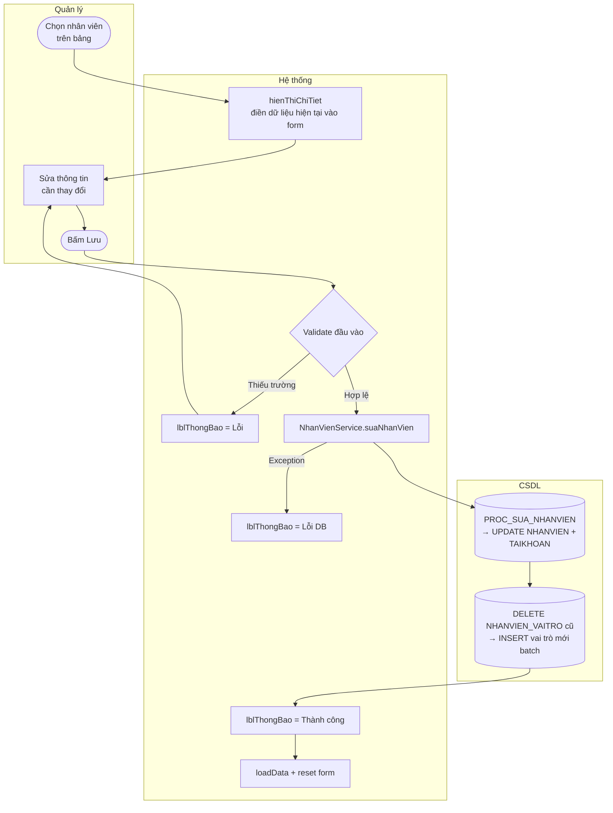

# UC05 — Sửa nhân sự

| Thành phần | Nội dung |
|:---|:---|
| **Tên Use-case** | Sửa nhân sự |
| **Mô tả Use-case** | Chỉnh sửa thông tin cá nhân (Họ tên, SĐT), cập nhật vai trò hoặc đổi mật khẩu của nhân viên đang làm việc. |
| **Actors** | Quản lý |
| **Tiền điều kiện** | Đã đăng nhập với vai trò Quản lý. Màn hình `QuanLyNhanVienView` đang mở. Đã chọn một nhân viên từ bảng. |
| **Hậu điều kiện** | Thông tin nhân viên được cập nhật trong `NHANVIEN`, `TAIKHOAN`, `NHANVIEN_VAITRO`. Danh sách được làm mới. |

---

## Luồng sự kiện chính

| Bước | Actor | Hành động |
|:-----|:------|:----------|
| 1 | Quản lý | Chọn nhân viên trên bảng `tblNhanVien` |
| 2 | Hệ thống | `hienThiChiTiet(NhanVienDTO)` — điền sẵn dữ liệu hiện tại vào form; tích chọn đúng các vai trò |
| 3 | Quản lý | Thay đổi các trường cần sửa (Họ tên, SĐT, Vai trò, Mật khẩu — để trống = giữ nguyên) |
| 4 | Quản lý | Bấm **Lưu** |
| 5 | Hệ thống (View) | Validate: Họ tên không trống, Tên đăng nhập không trống |
| 6 | Hệ thống (Service) | `NhanVienService xử lý` |
| 7 | CSDL | `PROC_SUA_NHANVIEN(MANV, HoTen, NgaySinh, SDT, TenDangNhap, MatKhau, TrangThai)` |
| 8 | CSDL | `DELETE FROM NHANVIEN_VAITRO WHERE MANV = ?` → `PROC_GAN_VAITRO_NHANVIEN` batch (vai trò mới) |
| 9 | Hệ thống | `lblThongBao = "✅ Cập nhật nhân viên thành công."` |
| 10 | Hệ thống | `loadData()` làm mới bảng, `onThemMoi()` reset form |

---

## Luồng sự kiện phụ

**3a — Không đổi mật khẩu:**
- Trường mật khẩu để trống → hệ thống giữ nguyên hash cũ (`selectedNhanVien xử lý`).

**3b — Đổi mật khẩu:**
- Nhập mật khẩu mới → `PasswordUtils xử lý` ghi đè lên `MATKHAU` trong `TAIKHOAN`.

---

## Luồng sự kiện lỗi

| Lỗi | Xử lý |
|:----|:------|
| Chưa chọn nhân viên | Không xảy ra — `selectedNhanVien == null` → nhánh Thêm mới thay vì Sửa |
| Họ tên để trống | `lblThongBao = "Vui lòng nhập Họ tên."` |
| SĐT trùng NV khác | Oracle unique constraint → `lblThongBao = "❌ Lỗi khi lưu: ..."` |
| DB không phản hồi | Exception → `lblThongBao = "❌ Lỗi khi lưu: ..."` |

---

## Activity Diagram

---

