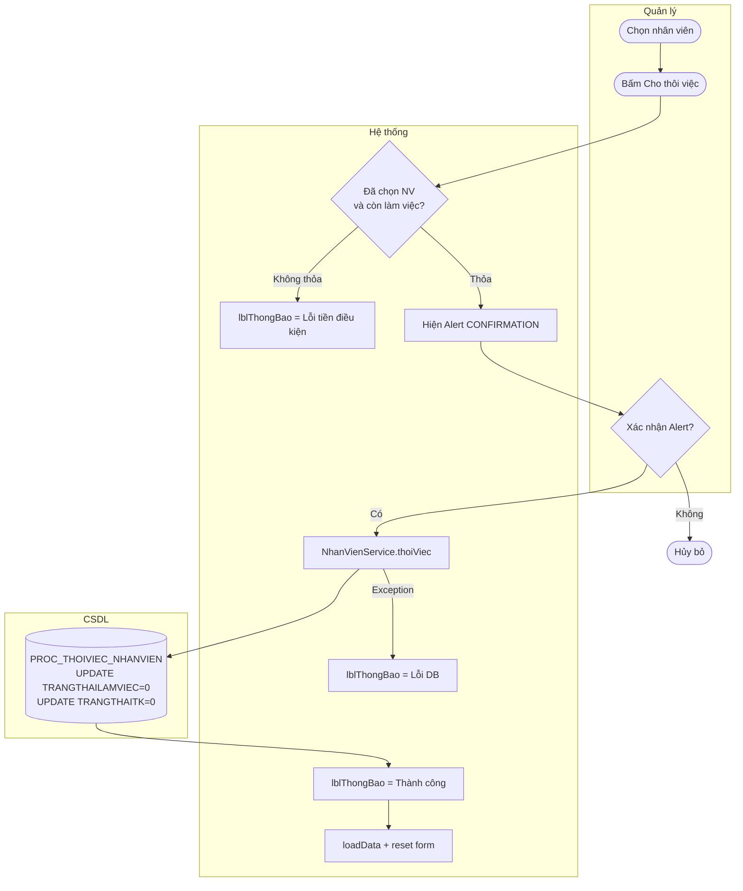

# UC06 — Cập nhật trạng thái nhân sự (Cho thôi việc / Kích hoạt lại)

| Thành phần | Nội dung |
|:---|:---|
| **Tên Use-case** | Cập nhật trạng thái nhân sự |
| **Mô tả Use-case** | Vô hiệu hóa (cho thôi việc) hoặc kích hoạt lại tài khoản nhân viên. Áp dụng soft-delete: dữ liệu lịch sử vẫn được bảo toàn, chỉ thay đổi cờ `TRANGTHAILAMVIEC` và `TRANGTHAITK`. |
| **Actors** | Quản lý |
| **Tiền điều kiện** | Đã đăng nhập với vai trò Quản lý. Màn hình `QuanLyNhanVienView` đang mở. Đã chọn nhân viên chưa thôi việc. |
| **Hậu điều kiện** | `NHANVIEN.TRANGTHAILAMVIEC = 0` và `TAIKHOAN.TRANGTHAITK = 0`. Nhân viên không thể đăng nhập tiếp. Lịch sử ca, hóa đơn, phiếu kho được giữ nguyên. |

---

## Luồng sự kiện chính — Cho thôi việc

| Bước | Actor | Hành động |
|:-----|:------|:----------|
| 1 | Quản lý | Chọn nhân viên đang làm việc trên bảng |
| 2 | Quản lý | Bấm **Cho thôi việc** |
| 3 | Hệ thống | Hiển thị `Alert CONFIRMATION` — "Cho nhân viên X thôi việc? Tài khoản sẽ bị khóa nhưng lịch sử được giữ lại." |
| 4 | Quản lý | Bấm **Có** xác nhận |
| 5 | Hệ thống (Service) | `NhanVienService xử lý` |
| 6 | CSDL | `PROC_THOIVIEC_NHANVIEN(MANV)` → `UPDATE NHANVIEN SET TRANGTHAILAMVIEC=0`, `UPDATE TAIKHOAN SET TRANGTHAITK=0` |
| 7 | Hệ thống | `lblThongBao = "✅ Đã cho nhân viên thôi việc thành công."` |
| 8 | Hệ thống | `loadData()` làm mới, `onThemMoi()` reset form |

---

## Luồng sự kiện phụ

**4a — Quản lý bấm Không:**
- Alert đóng lại, không có thay đổi nào được thực hiện.

**1a — Kích hoạt lại nhân viên đã thôi việc:**
- Quản lý chọn nhân viên `TRANGTHAILAMVIEC = 0` → tích `chkHoatDong` → bấm **Lưu** → nhánh UC05 `suaNhanVien()` với `TRANGTHAILAMVIEC = 1`.

---

## Luồng sự kiện lỗi

| Lỗi | Xử lý |
|:----|:------|
| Chưa chọn nhân viên | `lblThongBao = "Vui lòng chọn nhân viên cần cho thôi việc."` |
| Nhân viên đã thôi việc | `lblThongBao = "Nhân viên này đã thôi việc rồi."` — không mở Alert |
| DB lỗi Procedure | Exception → `lblThongBao = "❌ Lỗi cho thôi việc: ..."` |

---

## Activity Diagram

---

