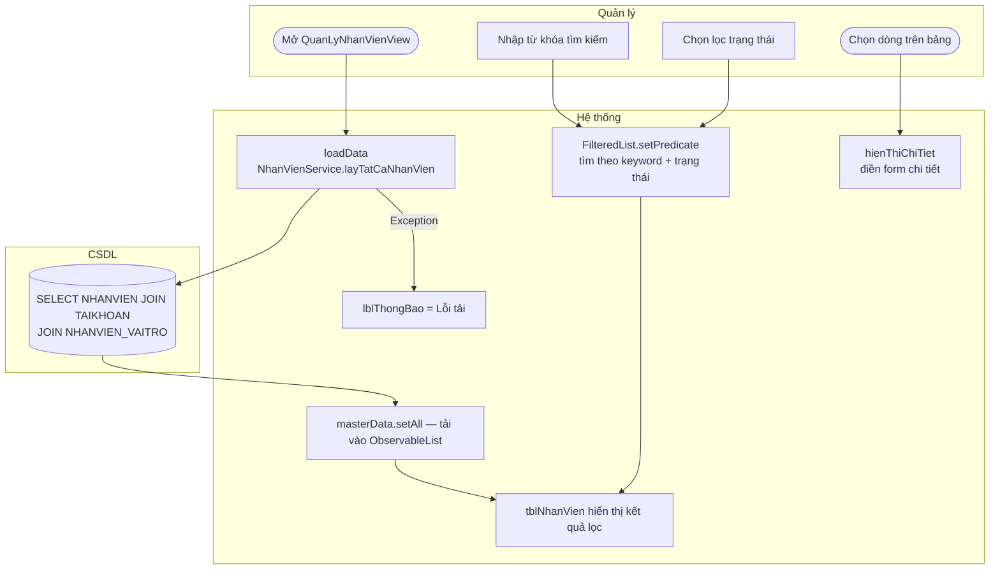

# UC07 — Tra cứu nhân sự

| Thành phần | Nội dung |
|:---|:---|
| **Tên Use-case** | Tra cứu nhân sự |
| **Mô tả Use-case** | Tìm kiếm và xem thông tin chi tiết nhân viên theo tên, SĐT hoặc tên đăng nhập. Hỗ trợ lọc theo trạng thái làm việc. Kết quả lọc theo thời gian thực không cần bấm nút tìm. |
| **Actors** | Quản lý |
| **Tiền điều kiện** | Đã đăng nhập với vai trò Quản lý. Màn hình `QuanLyNhanVienView` đang mở và đã tải xong danh sách nhân viên. |
| **Hậu điều kiện** | Danh sách được lọc hiển thị trên `tblNhanVien`. Nếu chọn một nhân viên, form bên phải hiển thị thông tin chi tiết (chỉ đọc cho đến khi bấm Lưu). |

---

## Luồng sự kiện chính

| Bước | Actor | Hành động |
|:-----|:------|:----------|
| 1 | Hệ thống | `initialize()` → `loadData()` → `NhanVienService xử lý` → load toàn bộ `NHANVIEN` vào `masterData` |
| 2 | Quản lý | Nhập từ khóa vào `txtTimKiem` (tên / SĐT / tên đăng nhập) |
| 3 | Hệ thống | `applyFilter()` tự động trigger qua `textProperty() xử lý` — lọc `FilteredList` theo keyword |
| 4 | Quản lý | Chọn giá trị `cmbLocTrangThai`: "Tất cả" / "Đang làm việc" / "Đã thôi việc" |
| 5 | Hệ thống | `applyFilter()` trigger lại — kết hợp cả keyword và trạng thái |
| 6 | Quản lý | Bấm chọn một dòng trên bảng |
| 7 | Hệ thống | `hienThiChiTiet(NhanVienDTO)` — điền thông tin chi tiết vào form bên phải |

---

## Luồng sự kiện phụ

**2a — Không tìm thấy kết quả:**
- `FilteredList` trả về rỗng → bảng hiển thị "No content in table" (JavaFX mặc định).

**1a — Lỗi tải dữ liệu ban đầu:**
- Exception → `masterData xử lý` + `lblThongBao = "Lỗi tải dữ liệu: ..."`.

**7a — Làm mới danh sách:**
- Quản lý bấm **Làm mới** → `onLamMoi()` → `loadData()` + reset form.

---

## Luồng sự kiện lỗi

| Lỗi | Xử lý |
|:----|:------|
| DB lỗi khi load | `lblThongBao = "Lỗi tải dữ liệu: ..."`, `masterData` rỗng, bảng trống |
| Danh sách rỗng | `lblThongBao = "Chưa có nhân viên nào trong hệ thống."` |

---

## Activity Diagram

---

