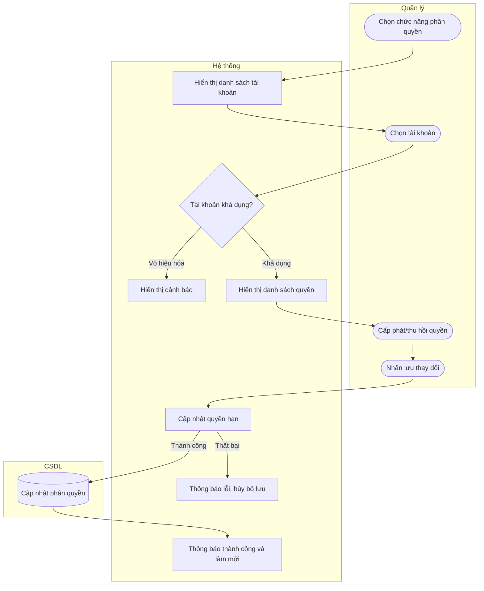

# UC08 — Phân quyền tài khoản

| Thành phần | Nội dung |
|:---|:---|
| **Tên Use-case** | Phân quyền tài khoản |
| **Mô tả** | Quản lý cấp phát hoặc giới hạn quyền truy cập vào các chức năng hệ thống cho nhân viên tùy theo vai trò. |
| **Actors** | Quản lý |
| **Tiền điều kiện** | - Quản lý đã đăng nhập và có quyền thiết lập hệ thống. - Tài khoản nhân viên đang tồn tại. |
| **Hậu điều kiện** | - Quyền truy cập của nhân viên được cập nhật. - Không làm ảnh hưởng đến dữ liệu hoạt động cũ. |

## Luồng sự kiện chính

1. Quản lý chọn chức năng phân quyền tài khoản.
2. Hệ thống hiển thị danh sách các tài khoản nhân viên.
3. Quản lý chọn một tài khoản cần phân quyền.
4. Hệ thống hiển thị danh sách các quyền truy cập.
5. Quản lý chọn cấp phát hoặc thu hồi quyền tương ứng.
6. Quản lý nhấn lưu thay đổi.
7. Hệ thống cập nhật quyền hạn cho tài khoản đó.
8. Hệ thống thông báo thành công và làm mới màn hình.

## Luồng sự kiện phụ

4a. Tài khoản đang bị vô hiệu hóa, hệ thống hiển thị cảnh báo và không cho phép thay đổi quyền.
5a. Quản lý không thay đổi quyền và nhấn lưu, hệ thống vẫn tiến hành cập nhật dữ liệu.

## Luồng sự kiện lỗi

- Bước 7: Lỗi lưu, hệ thống báo lỗi, quyền không thay đổi, quá trình lưu bị hủy bỏ.

## Activity Diagram

