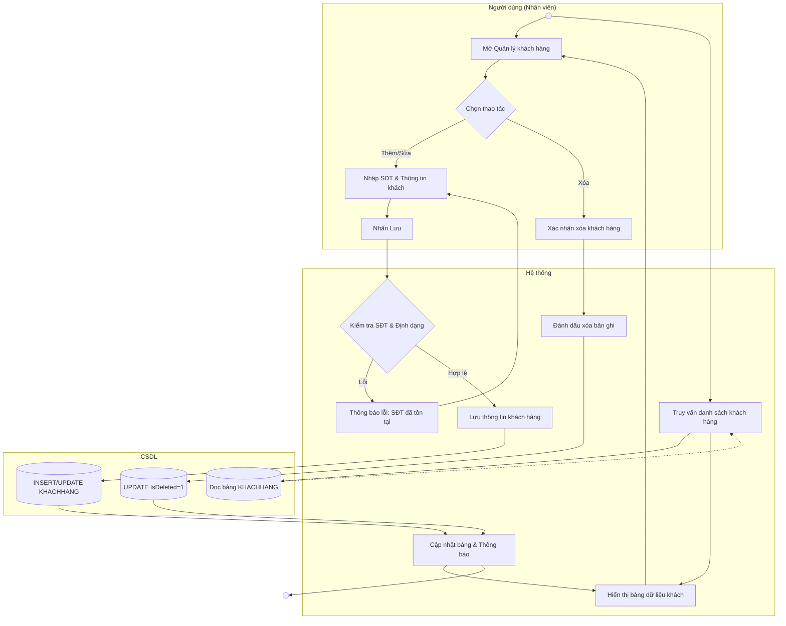

# Đặc tả Use-case: UC08 - Quản lý khách hàng

| Thành phần | Nội dung |
|:---|:---|
| **Tên Use-case** | **Quản lý khách hàng** |
| **Mô tả Use-case** | Hệ thống lưu trữ và quản lý thông tin khách hàng (SĐT, Họ tên, Địa chỉ) để phục vụ tích điểm và chăm sóc khách hàng VIP. |
| **Actors** | Thu ngân, Quản lý cửa hàng |
| **Tiền điều kiện** | Nhân viên đã đăng nhập vào hệ thống. |
| **Hậu điều kiện** | Thông tin khách hàng được lưu trữ sẵn sàng để tra cứu tại màn hình bán hàng. |
| **Luồng sự kiện chính** | 1. Người dùng mở màn hình "Quản lý khách hàng". 2. Hệ thống hiển thị danh sách khách hàng từ CSDL. 3. **Nếu Thêm:** Người dùng nhấn "Thêm mới" và nhập SĐT, Họ tên. 4. **Nếu Sửa:** Người dùng chọn khách hàng và cập nhật thông tin. 5. Hệ thống kiểm tra SĐT phải đủ 10 số và không trùng lặp. 6. Hệ thống thực hiện ghi dữ liệu vào bảng KHACHHANG. 7. Hệ thống cập nhật lại danh sách và thông báo thành công. |

## Activity Diagram (Sơ đồ hoạt động)

