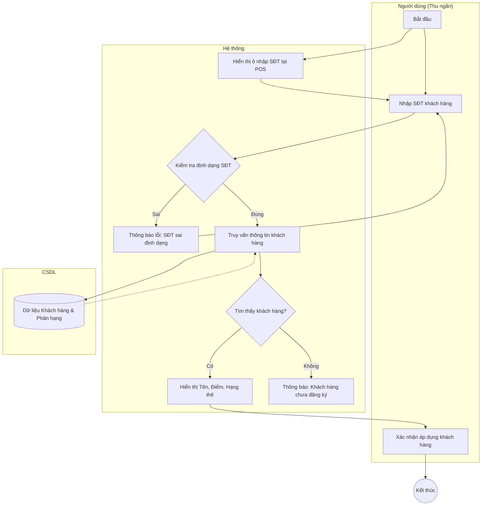

# Đặc tả Use-case: UC09 - Tra cứu khách hàng

| Thành phần | Nội dung |
|:---|:---|
| **Tên Use-case** | **Tra cứu khách hàng** |
| **Mô tả Use-case** | Thu ngân tìm kiếm thông tin khách hàng dựa trên Số điện thoại ngay tại màn hình bán hàng để áp dụng các chính sách ưu đãi, tích điểm. |
| **Actors** | Thu ngân |
| **Tiền điều kiện** | Khách hàng đã được đăng ký thông tin trong hệ thống. |
| **Hậu điều kiện** | Thông tin khách hàng, hạng thẻ (Đồng/Bạc/Vàng) được hiển thị và áp dụng vào hóa đơn hiện tại. |
| **Luồng sự kiện chính** | 1. Tại màn hình bán hàng (POS), thu ngân nhập Số điện thoại vào ô tìm kiếm khách hàng. 2. Hệ thống thực hiện truy vấn CSDL theo SĐT đã nhập. 3. Hệ thống kiểm tra định dạng SĐT (10 số). 4. Nếu tìm thấy, hệ thống hiển thị Tên khách hàng, Số điểm tích lũy và Hạng thành viên. 5. Hệ thống tự động tính toán mức giảm giá dựa trên hạng thẻ của khách hàng đó. 6. Thu ngân xác nhận áp dụng khách hàng vào hóa đơn. |
| **Luồng sự kiện phụ** | 4a. Nếu không tìm thấy khách hàng, hệ thống hiển thị thông báo "Khách hàng mới" và cho phép mở nhanh hộp thoại đăng ký khách hàng mới. |

## Activity Diagram (Sơ đồ hoạt động)

