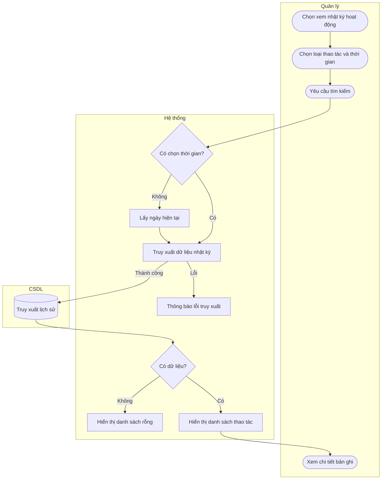

# UC09 — Xem nhật ký hoạt động

| Thành phần | Nội dung |
|:---|:---|
| **Tên Use-case** | Xem nhật ký hoạt động |
| **Mô tả** | Quản lý tra cứu lịch sử các thao tác nhạy cảm như hủy đơn, sửa giá để kiểm soát rủi ro hệ thống. |
| **Actors** | Quản lý |
| **Tiền điều kiện** | Quản lý đã đăng nhập và có quyền xem nhật ký hoạt động của hệ thống. |
| **Hậu điều kiện** | - Lịch sử nhật ký hoạt động được hiển thị chính xác. - Không có dữ liệu nào bị thay đổi. |

## Luồng sự kiện chính

1. Quản lý chọn chức năng xem nhật ký hoạt động.
2. Quản lý chọn loại thao tác và khoảng thời gian cần tra cứu.
3. Quản lý yêu cầu hệ thống tìm kiếm.
4. Hệ thống truy xuất dữ liệu từ nhật ký hoạt động.
5. Hệ thống hiển thị danh sách các thao tác bao gồm người thực hiện, thời gian và tóm tắt nội dung.
6. Quản lý chọn xem chi tiết một bản ghi để kiểm tra.

## Luồng sự kiện phụ

2a. Quản lý không chọn khoảng thời gian, hệ thống mặc định lấy nhật ký của ngày hiện tại.
5a. Không có dữ liệu phù hợp, hệ thống hiển thị danh sách rỗng và thông báo trống.

## Luồng sự kiện lỗi

- Bước 4: Lỗi truy xuất dữ liệu, hệ thống báo lỗi, không hiển thị được danh sách nhật ký.

## Activity Diagram

