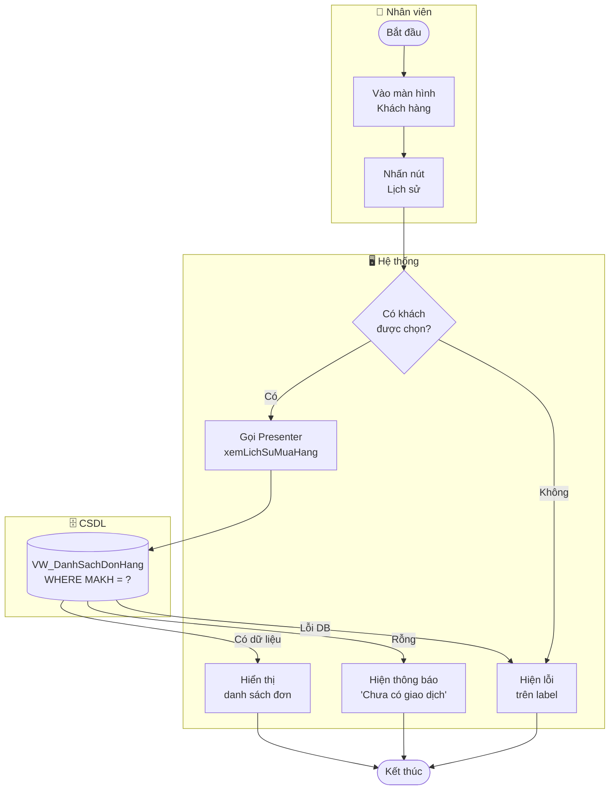

# UC10 — Xem lịch sử mua hàng

| Thành phần | Nội dung |
|:---|:---|
| **Tên Use-case** | Xem lịch sử mua hàng |
| **Mô tả Use-case** | Nhân viên tra cứu danh sách các đơn hàng cũ của một khách hàng cụ thể để hỗ trợ bảo hành hoặc tư vấn. |
| **Actors** | Thu ngân, Quản lý |
| **Tiền điều kiện** | Nhân viên đã đăng nhập và có quyền truy cập thông tin khách hàng. Đã chọn một khách hàng cụ thể từ danh sách. |
| **Hậu điều kiện** | Lịch sử mua hàng của khách hàng được hiển thị trong cửa sổ riêng. Không có dữ liệu nào bị thay đổi. |
| **Luồng sự kiện chính** | 1. Nhân viên vào màn hình Quản lý Khách hàng. 2. Hệ thống hiển thị danh sách khách hàng. 3. Nhân viên nhấn nút **"📋 Lịch sử"** trên dòng khách hàng muốn xem. 4. Hệ thống truy vấn DB lấy danh sách đơn hàng theo mã khách hàng. 5. Hệ thống mở cửa sổ hiển thị danh sách đơn: Mã đơn, Ngày nhận, Trạng thái, Tổng tiền, Đã cọc. |
| **Luồng sự kiện phụ** | **3a.** Khách hàng chưa từng mua hàng — hệ thống hiển thị thông báo "Khách hàng chưa có lịch sử giao dịch." |
| **Luồng sự kiện lỗi hoặc ngoại lệ** | **Bước 4:** Lỗi kết nối DB — hệ thống hiển thị thông báo lỗi trên label trạng thái, cửa sổ không mở. |

---

## Activity Diagram

---

