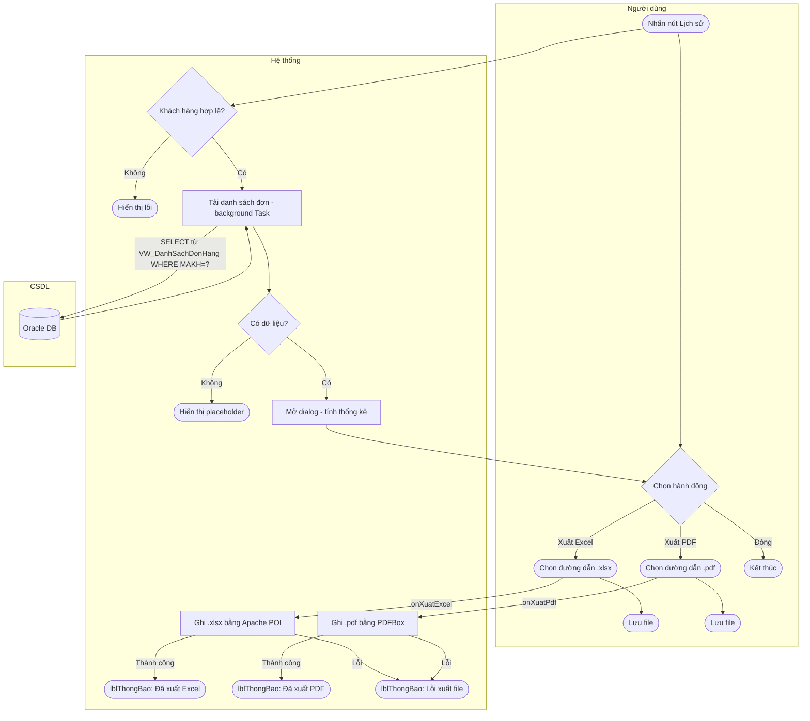

# UC10 — Xem Lịch Sử Mua Hàng Và Xuất Báo Cáo

| Thành phần | Nội dung |
|:---|:---|
| **Tên Use-case** | Xem lịch sử mua hàng và xuất báo cáo |
| **Mô tả Use-case** | Nhân viên quản lý xem toàn bộ lịch sử đơn hàng của một khách hàng cụ thể, với thống kê tổng chi tiêu và xuất báo cáo ra định dạng Excel hoặc PDF |
| **Actors** | Nhân viên quản lý khách hàng |
| **Tiền điều kiện** | Đã đăng nhập hệ thống; màn hình Quản lý Khách hàng đang mở; có ít nhất một khách hàng trong danh sách |
| **Hậu điều kiện** | Dialog lịch sử hiển thị đầy đủ thông tin đơn hàng; nếu xuất file thì file Excel/PDF được lưu tại vị trí người dùng chọn |
| **Luồng sự kiện chính** | 1. Nhân viên nhấn nút **📋 Lịch sử** trên dòng khách hàng trong bảng danh sách  2. Hệ thống gọi Presenter → Service → DAO truy vấn `VW_DanhSachDonHang` theo `MAKH`  3. Dialog `LichSuMuaHangDialog` mở ra (900×560, modal) hiển thị:  &nbsp;&nbsp;- Thẻ thống kê: Tổng đơn, Tổng chi tiêu, Đã cọc  &nbsp;&nbsp;- Bảng 7 cột: Mã đơn, Ngày nhận, Trạng thái, Hình thức, Tổng tiền, Đã cọc, Còn lại  4a. Nhân viên nhấn **📥 Xuất Excel** → Hộp thoại lưu file → lưu `.xlsx`  4b. Nhân viên nhấn **📄 Xuất PDF** → Hộp thoại lưu file → lưu `.pdf`  5. Nhân viên nhấn **✕ Đóng** |
| **Luồng sự kiện phụ** | 2a. Khách hàng chưa có đơn nào → bảng hiển thị placeholder "Khách hàng chưa có lịch sử giao dịch."  4a-1. Người dùng hủy hộp thoại lưu → không thực hiện xuất |
| **Luồng sự kiện lỗi hoặc ngoại lệ** | 2b. Lỗi kết nối DB → Presenter bắt exception, gọi `view xử lý`, label `lblThongBao` hiển thị thông báo đỏ  4c. Lỗi ghi file (quyền, đĩa đầy) → label `lblThongBao` trong dialog hiển thị "❌ Lỗi xuất file: ..." |

---

## Activity Diagram

