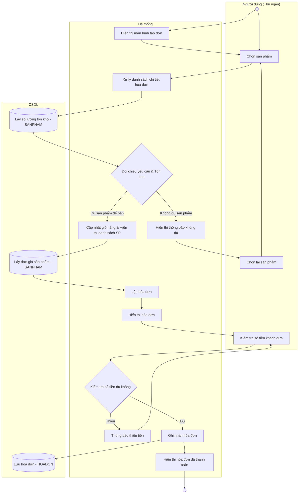

# Đặc tả Use-case: UC12 - Lập hóa đơn bán lẻ (POS)

| Thành phần | Nội dung |
|:---|:---|
| **Tên Use-case** | **Lập hóa đơn bán lẻ** |
| **Mô tả Use-case** | Nhân viên thu ngân thực hiện chọn sản phẩm khách mua, kiểm tra tồn kho, tính tiền và in hóa đơn cho khách hàng tại quầy. |
| **Actors** | Thu ngân |
| **Tiền điều kiện** | Thu ngân đã đăng nhập, hệ thống đã nạp danh sách sản phẩm và giá bán. |
| **Hậu điều kiện** | Hóa đơn được lưu vào hệ thống, số lượng tồn kho giảm tương ứng, hóa đơn được in ra cho khách. |
| **Luồng sự kiện chính** | 1. Hệ thống hiển thị màn hình tạo đơn hàng. 2. Thu ngân chọn các sản phẩm khách muốn mua từ danh sách. 3. Hệ thống xử lý danh sách chi tiết hóa đơn và tính toán số lượng. 4. Hệ thống truy vấn CSDL để lấy số lượng tồn kho hiện tại. 5. Hệ thống thực hiện đối chiếu giữa yêu cầu khách hàng và số lượng thực tế trong kho. 6. Nếu đủ sản phẩm, hệ thống cập nhật giỏ hàng và hiển thị danh sách sản phẩm lên màn hình. 7. Hệ thống lấy đơn giá từ CSDL và thực hiện lập hóa đơn (tổng tiền, giảm giá). 8. Hệ thống hiển thị hóa đơn xem trước. 9. Thu ngân kiểm tra số tiền khách đưa. 10. Nếu số tiền hợp lệ, hệ thống thực hiện ghi nhận hóa đơn. 11. Hệ thống lưu hóa đơn vào CSDL (Bảng HOADON). 12. Hệ thống hiển thị hóa đơn đã được thanh toán và thông báo hoàn tất. |
| **Luồng sự kiện phụ** | 2a. Thu ngân có thể nhập SĐT khách hàng để áp dụng giảm giá thành viên theo đúng hạng (Bạc/Vàng/Kim cương...) được cấu hình trong hệ thống. |
| **Luồng sự kiện lỗi hoặc ngoại lệ** | - **Không đủ sản phẩm (kiểm tra trước):** Nếu đối chiếu tồn kho thấy thiếu, hệ thống hiển thị thông báo "Không đủ sản phẩm" và yêu cầu thu ngân chọn lại hoặc giảm số lượng. - **Không đủ tiền:** Nếu tiền khách đưa nhỏ hơn tổng tiền hóa đơn, hệ thống thông báo và yêu cầu bổ sung tiền. - **Xung đột tồn kho đồng thời (Race Condition):** Khi hai POS cùng đặt hàng sản phẩm có tồn kho = 1: &nbsp;&nbsp;1. POS thứ nhất gửi yêu cầu → DB khóa dòng sản phẩm (`SELECT FOR UPDATE`) → kiểm tra tồn kho đủ → trừ kho → COMMIT thành công. &nbsp;&nbsp;2. POS thứ hai (đến sau) cũng gửi yêu cầu → DB cố khóa dòng cùng sản phẩm → đợi POS 1 COMMIT → sau khi POS 1 COMMIT, POS 2 đọc lại tồn kho = 0 → DB ném lỗi "Giao dịch thất bại: Sản phẩm X chỉ còn 0 cái, không đủ Y cái yêu cầu." &nbsp;&nbsp;3. Hệ thống bắt ngoại lệ từ DB, hiển thị thông báo **"Đặt đơn thất bại: Sản phẩm đã hết hàng trong lúc xử lý. Vui lòng kiểm tra lại giỏ hàng."** lên màn hình POS thứ hai. Không có dữ liệu nào bị ghi. |

## Activity Diagram (Sơ đồ hoạt động)

