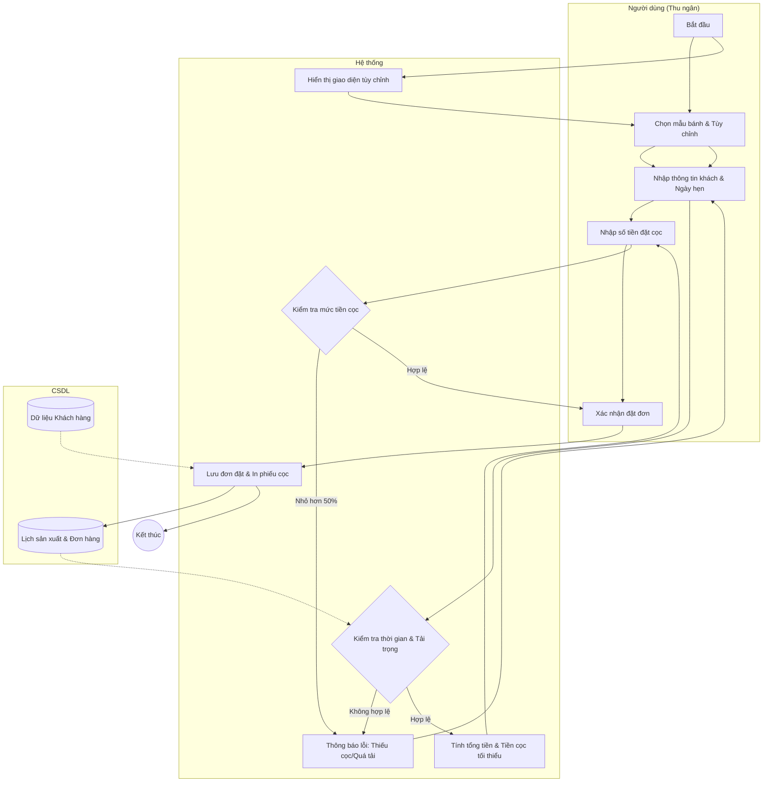

# Đặc tả Use-case: UC13 - Lập đơn đặt bánh tùy chỉnh

| Thành phần | Nội dung |
|:---|:---|
| **Tên Use-case** | **Lập đơn đặt bánh tùy chỉnh** |
| **Mô tả Use-case** | Hệ thống cho phép thu ngân tạo đơn đặt hàng cho các loại bánh yêu cầu riêng (bánh sinh nhật, bánh sự kiện), hẹn ngày nhận và thu tiền đặt cọc. |
| **Actors** | Thu ngân |
| **Tiền điều kiện** | Thu ngân đã đăng nhập và đang ở giao diện đặt hàng. |
| **Hậu điều kiện** | Đơn đặt hàng được lưu ở trạng thái "Chờ xử lý", phiếu thu tiền cọc được in và kho nguyên liệu được dự báo. |
| **Luồng sự kiện chính** | 1. Thu ngân chọn chức năng "Đặt bánh tùy chỉnh". 2. Thu ngân chọn mẫu bánh cơ bản và các thành phần tùy chọn (kích cỡ, nhân, cốt, trang trí). 3. Thu ngân nhập thông tin khách hàng (SĐT, Tên) và các yêu cầu chi tiết (lời chúc, mẫu ảnh). 4. Thu ngân chọn **Ngày nhận bánh** và **Giờ nhận bánh**. 5. Hệ thống kiểm tra năng lực sản xuất của xưởng tại thời điểm đó. 6. Hệ thống tính tổng giá trị đơn hàng và số tiền **Đặt cọc tối thiểu (50%)**. 7. Thu ngân nhập số tiền khách đặt cọc. 8. Thu ngân nhấn "Xác nhận đặt đơn". 9. Hệ thống lưu đơn hàng, in phiếu đặt cọc và thông báo thành công. |
| **Luồng sự kiện phụ** | 3a. Nếu khách hàng đã có trong hệ thống, hệ thống tự động hiển thị tên và hạng thành viên khi nhập SĐT. |
| **Luồng sự kiện lỗi hoặc ngoại lệ** | - Nếu ngày nhận bánh quá cận (ví dụ: trong vòng 24h), hệ thống hiển thị thông báo "Không đủ thời gian chuẩn bị" và yêu cầu chọn lại. - Nếu xưởng đã quá tải đơn vào ngày đó, hệ thống chặn không cho đặt thêm. - Nếu số tiền cọc nhỏ hơn 50%, hệ thống hiển thị thông báo lỗi và không cho phép lưu đơn. |

## Activity Diagram (Sơ đồ hoạt động)

