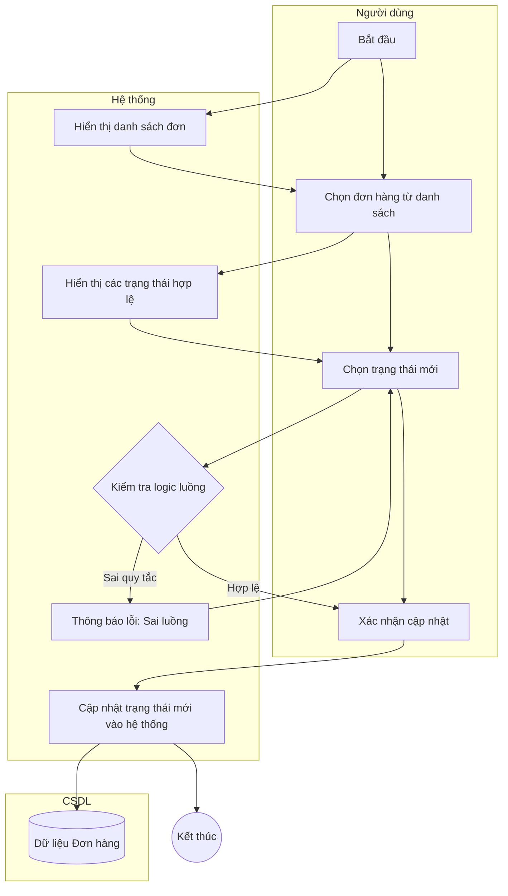

# Đặc tả Use-case: UC14 - Cập nhật trạng thái đơn

| Thành phần | Nội dung |
|:---|:---|
| **Tên Use-case** | **Cập nhật trạng thái đơn** |
| **Mô tả Use-case** | Cho phép nhân viên cập nhật tiến độ của đơn hàng từ khi tiếp nhận đến khi hoàn thành hoặc giao cho khách. |
| **Actors** | Thu ngân, Thợ làm bánh, Quản lý cửa hàng |
| **Tiền điều kiện** | Đơn hàng đã tồn tại trong hệ thống. |
| **Hậu điều kiện** | Trạng thái đơn hàng được thay đổi và cập nhật thời gian thực trên màn hình theo dõi. |
| **Luồng sự kiện chính** | 1. Người dùng truy cập vào danh sách đơn hàng đang xử lý. 2. Người dùng chọn đơn hàng cần cập nhật. 3. Hệ thống hiển thị trạng thái hiện tại và các trạng thái kế tiếp có thể chuyển đổi (ví dụ: Chờ xử lý -> Đang làm). 4. Người dùng chọn trạng thái mới. 5. Hệ thống kiểm tra tính logic của luồng trạng thái. 6. Người dùng xác nhận cập nhật. 7. Hệ thống ghi nhận thay đổi và thông báo thành công. |
| **Luồng sự kiện phụ** | 4a. Nếu đơn hàng chuyển sang trạng thái "Hoàn thành", hệ thống tự động nhắc thu ngân thu phần tiền còn lại (nếu có). |
| **Luồng sự kiện lỗi hoặc ngoại lệ** | - Hệ thống chặn không cho phép chuyển trạng thái nhảy cóc (ví dụ: từ Chờ xử lý nhảy thẳng sang Hoàn thành mà bỏ qua bước Đang làm). - Nếu đơn hàng đã bị hủy, không thể cập nhật trạng thái nữa. |

## Activity Diagram (Sơ đồ hoạt động)

