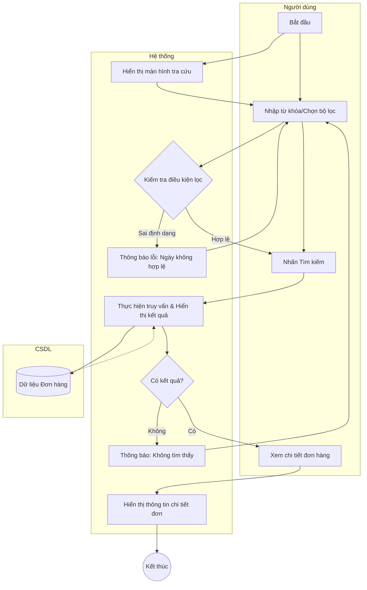

# Đặc tả Use-case: UC15 - Tra cứu danh sách đơn

| Thành phần | Nội dung |
|:---|:---|
| **Tên Use-case** | **Tra cứu danh sách đơn** |
| **Mô tả Use-case** | Hệ thống cho phép người dùng tìm kiếm và xem danh sách các đơn hàng theo nhiều tiêu chí lọc khác nhau. |
| **Actors** | Thu ngân, Quản lý cửa hàng, Thợ làm bánh |
| **Tiền điều kiện** | Người dùng đã đăng nhập vào hệ thống. |
| **Hậu điều kiện** | Danh sách đơn hàng thỏa mãn điều kiện lọc được hiển thị. |
| **Luồng sự kiện chính** | 1. Người dùng truy cập màn hình "Theo dõi đơn hàng". 2. Hệ thống hiển thị mặc định các đơn hàng cần xử lý trong ngày. 3. Người dùng nhập từ khóa tìm kiếm (Mã đơn, SĐT khách) hoặc chọn bộ lọc (Ngày nhận, Trạng thái). 4. Người dùng nhấn nút "Tìm kiếm". 5. Hệ thống thực hiện truy vấn và hiển thị kết quả. |
| **Luồng sự kiện phụ** | 5a. Người dùng nhấn vào một đơn hàng cụ thể để xem chi tiết các món bánh và yêu cầu tùy chỉnh đính kèm. |
| **Luồng sự kiện lỗi hoặc ngoại lệ** | - Nếu không tìm thấy đơn hàng nào khớp với điều kiện, hệ thống hiển thị thông báo "Không tìm thấy kết quả". - Nếu khoảng thời gian lọc không hợp lệ (ngày bắt đầu lớn hơn ngày kết thúc), hệ thống báo lỗi. |

## Activity Diagram (Sơ đồ hoạt động)

