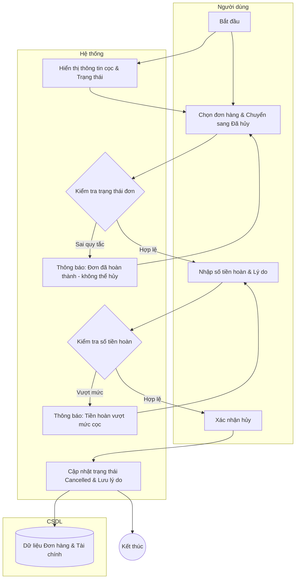

# Đặc tả Use-case: UC16 - Hủy đơn và hoàn cọc

| Thành phần | Nội dung |
|:---|:---|
| **Tên Use-case** | **Hủy đơn và hoàn cọc** |
| **Mô tả Use-case** | Cho phép nhân viên hủy các đơn đặt hàng (thường là đơn đặt bánh tùy chỉnh) và xử lý việc hoàn trả lại tiền đặt cọc cho khách hàng. |
| **Actors** | Thu ngân, Quản lý cửa hàng |
| **Tiền điều kiện** | Đơn hàng đang ở trạng thái chưa hoàn thành (ví dụ: Đã cọc, Đang sản xuất). |
| **Hậu điều kiện** | Trạng thái đơn chuyển sang "Đã hủy", tiền hoàn trả được ghi nhận vào hệ thống tài chính. |
| **Luồng sự kiện chính** | 1. Người dùng truy cập màn hình "Theo dõi đơn hàng". 2. Tìm kiếm và chọn đơn hàng cần hủy. 3. Hệ thống hiển thị chi tiết đơn và số tiền khách đã đặt cọc. 4. Người dùng chọn chức năng chuyển trạng thái sang "Đã hủy". 5. Hệ thống yêu cầu xác nhận và nhập lý do hủy đơn. 6. Người dùng nhập số tiền thực tế hoàn trả cho khách. 7. Hệ thống kiểm tra số tiền hoàn trả không vượt quá số tiền đã cọc. 8. Hệ thống lưu trạng thái mới và ghi nhận giao dịch hoàn tiền. 9. Hệ thống cập nhật nhãn trạng thái (Badge) sang màu đỏ (Cancelled). |
| **Luồng sự kiện lỗi hoặc ngoại lệ** | - Nếu đơn hàng đã ở trạng thái "Hoàn thành", hệ thống chặn không cho phép hủy. - Nếu số tiền hoàn trả nhập vào lớn hơn số tiền khách đã cọc, hệ thống báo lỗi và yêu cầu nhập lại. |

## Activity Diagram (Sơ đồ hoạt động)

