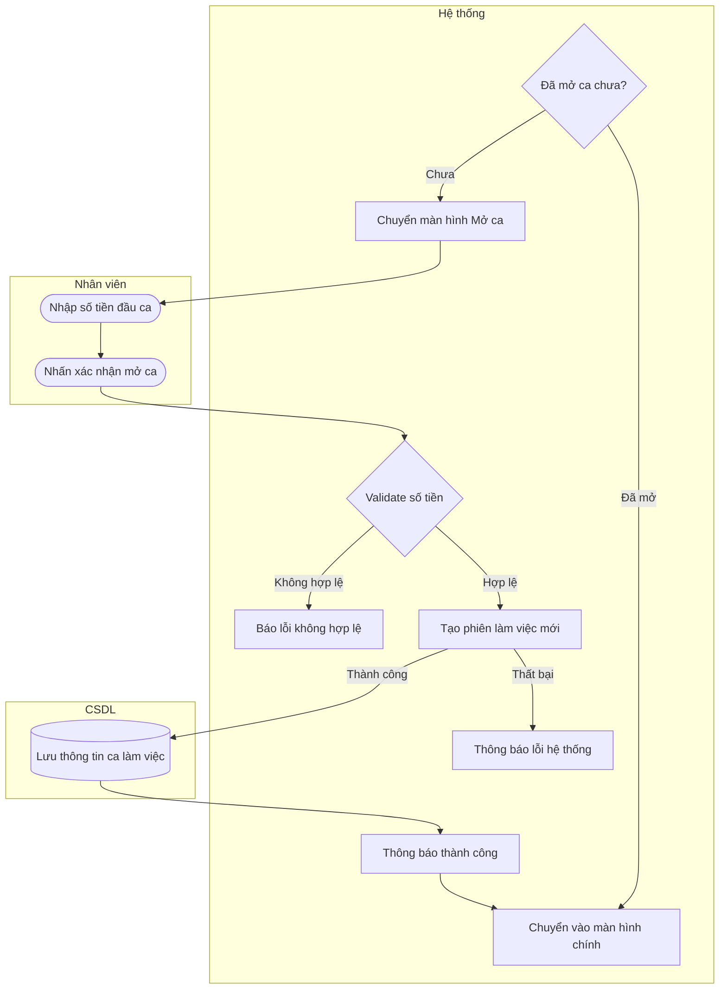

# UC22 — Mở ca làm việc

| Thành phần | Nội dung |
|:---|:---|
| **Tên Use-case** | Mở ca làm việc |
| **Mô tả** | Ghi nhận số tiền mặt ban đầu có sẵn trong két sắt khi bắt đầu ca làm việc mới để làm cơ sở đối soát cuối ca. |
| **Actors** | Thu ngân, Quản lý |
| **Tiền điều kiện** | Nhân viên đã đăng nhập và chưa có ca làm việc nào đang mở. |
| **Hậu điều kiện** | - Ca làm việc mới được tạo thành công với số tiền đầu ca. - Hệ thống chuyển vào màn hình chính (Dashboard/POS). |

## Luồng sự kiện chính

1. Hệ thống tự động chuyển hướng đến màn hình Mở ca ngay sau khi nhân viên đăng nhập thành công (nếu chưa có ca mở).
2. Hệ thống hiển thị form yêu cầu nhập số tiền mặt hiện có trong két.
3. Nhân viên kiểm đếm tiền mặt thực tế và nhập số tiền vào hệ thống.
4. Nhân viên nhấn nút xác nhận mở ca.
5. Hệ thống xác thực số tiền nhập vào là hợp lệ (số dương).
6. Hệ thống tạo mới phiên làm việc (Ca) trong cơ sở dữ liệu với số tiền đầu ca.
7. Hệ thống thông báo mở ca thành công và chuyển vào màn hình chính.

## Luồng sự kiện lỗi

- Bước 5: Số tiền nhập vào không hợp lệ (để trống, chứa chữ, hoặc số âm), hệ thống báo lỗi yêu cầu nhập lại và không mở ca.
- Bước 6: Lỗi kết nối cơ sở dữ liệu, hệ thống báo lỗi không thể tạo ca và yêu cầu thử lại.

## Activity Diagram

