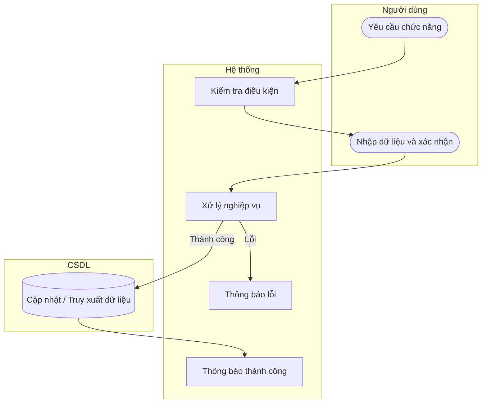

# UC23 — Đóng ca và đối soát

| Thành phần | Nội dung |
|:---|:---|
| **Tên Use-case** | Đóng ca và đối soát |
| **Mô tả** | Thao tác thực hiện khi kết thúc ca làm việc. Nhân viên kiểm đếm tiền mặt thực tế tại quầy, nhập vào hệ thống để đối chiếu với tổng doanh thu bằng tiền mặt phát sinh trong ca. Hệ thống sẽ tự động tính toán mức độ chênh lệch (nếu có) và lưu lại báo cáo đóng ca. |
| **Actors** | Thu ngân |
| **Tiền điều kiện** | Ca làm việc đang mở. |
| **Hậu điều kiện** | Ca làm việc được đóng, báo cáo đối soát được lưu. |

## Luồng sự kiện chính

1. Thu ngân chọn đóng ca làm việc.
2. Hệ thống tổng hợp tổng doanh thu và tiền mặt dự kiến.
3. Thu ngân kiểm đếm và nhập số tiền mặt thực tế.
4. Hệ thống tính toán chênh lệch.
5. Thu ngân xác nhận đóng ca (nhập lý do nếu có chênh lệch âm).
6. Hệ thống lưu báo cáo và kết thúc ca làm việc.

## Luồng sự kiện lỗi

- Chưa nhập lý do chênh lệch âm: Hệ thống báo lỗi.

## Activity Diagram

