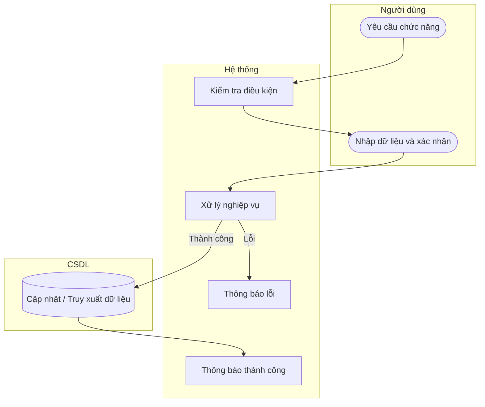

# UC24 — Thêm danh mục sản phẩm

| Thành phần | Nội dung |
|:---|:---|
| **Tên Use-case** | Thêm danh mục sản phẩm |
| **Mô tả** | Tạo mới một nhóm phân loại hàng hóa. |
| **Actors** | Quản lý |
| **Tiền điều kiện** | Đã đăng nhập quyền Quản lý. |
| **Hậu điều kiện** | Danh mục mới được thêm vào hệ thống. |

## Luồng sự kiện chính

1. Quản lý chọn chức năng thêm danh mục.
2. Quản lý nhập tên danh mục và mô tả.
3. Quản lý nhấn lưu.
4. Hệ thống kiểm tra trùng lặp và lưu dữ liệu.
5. Hệ thống thông báo thành công.

## Luồng sự kiện lỗi

- Tên trùng lặp: Cảnh báo danh mục đã tồn tại.

## Activity Diagram

