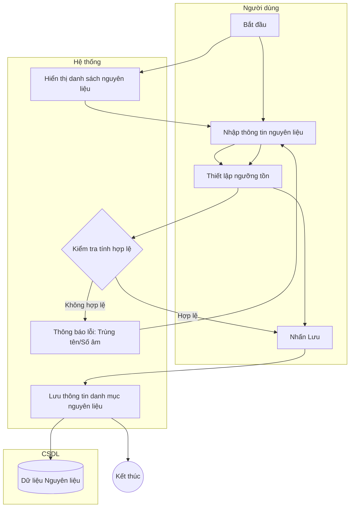

# Đặc tả Use-case: UC25 - Quản lý nguyên liệu

| Thành phần | Nội dung |
|:---|:---|
| **Tên Use-case** | **Quản lý nguyên liệu** |
| **Mô tả Use-case** | Hệ thống cho phép quản lý danh mục các loại nguyên liệu (bột, bơ, đường...) được sử dụng trong quá trình sản xuất bánh. |
| **Actors** | Thủ kho, Quản lý cửa hàng |
| **Tiền điều kiện** | Người dùng đã đăng nhập và có quyền truy cập vào mục Kho. |
| **Hậu điều kiện** | Danh mục nguyên liệu được cập nhật, làm cơ sở cho việc nhập/xuất kho và tính công thức bánh. |
| **Luồng sự kiện chính** | 1. Người dùng truy cập vào "Quản lý nguyên liệu". 2. Hệ thống hiển thị danh sách các nguyên liệu kèm theo đơn vị tính và số lượng tồn hiện tại. 3. Người dùng chọn "Thêm nguyên liệu" hoặc chọn nguyên liệu để "Cập nhật". 4. Người dùng nhập: Tên nguyên liệu, Đơn vị tính (kg, lít, cái...), Đơn giá tham khảo. 5. Hệ thống kiểm tra tên nguyên liệu có bị trùng lặp không. 6. Người dùng nhấn "Lưu". 7. Hệ thống thông báo cập nhật thành công. |
| **Luồng sự kiện phụ** | 3a. Người dùng có thể thiết lập "Ngưỡng tồn tối thiểu" để hệ thống tự động cảnh báo khi sắp hết hàng. |
| **Luồng sự kiện lỗi hoặc ngoại lệ** | - Nếu nguyên liệu đang được sử dụng trong một "Công thức bánh" hoặc còn tồn kho, hệ thống sẽ chặn không cho phép Xóa danh mục này. - Nếu nhập số liệu (đơn giá, ngưỡng tồn) là số âm, hệ thống báo lỗi định dạng. |

## Activity Diagram (Sơ đồ hoạt động)

