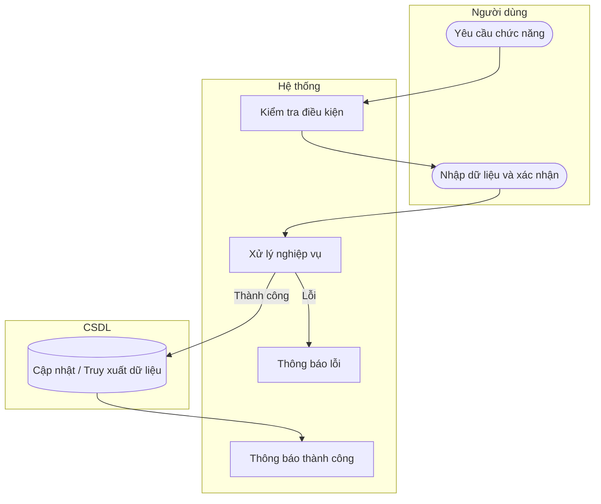

# UC26 — Cập nhật trạng thái danh mục sản phẩm

| Thành phần | Nội dung |
|:---|:---|
| **Tên Use-case** | Cập nhật trạng thái danh mục sản phẩm |
| **Mô tả** | Khóa các danh mục không còn kinh doanh để ẩn khỏi màn hình bán hàng, đảm bảo không làm vỡ dữ liệu của các bánh đã bán thuộc danh mục này trước đây. |
| **Actors** | Quản lý |
| **Tiền điều kiện** | Đã chọn danh mục sản phẩm. |
| **Hậu điều kiện** | Trạng thái danh mục được thay đổi. |

## Luồng sự kiện chính

1. Quản lý chọn vô hiệu hóa danh mục.
2. Hệ thống cảnh báo các sản phẩm con cũng có thể bị ảnh hưởng.
3. Quản lý xác nhận.
4. Hệ thống thay đổi trạng thái danh mục.
5. Hệ thống làm mới danh sách hiển thị.

## Luồng sự kiện lỗi

- Không có ngoại lệ đặc biệt.

## Activity Diagram

