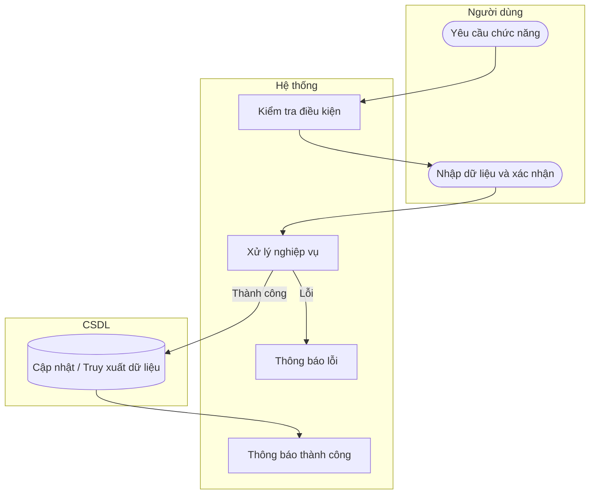

# UC27 — Thêm sản phẩm

| Thành phần | Nội dung |
|:---|:---|
| **Tên Use-case** | Thêm sản phẩm |
| **Mô tả** | Đưa một loại bánh mới vào thực đơn với đầy đủ thông tin giá bán, hình ảnh và danh mục tương ứng. |
| **Actors** | Quản lý |
| **Tiền điều kiện** | Danh mục sản phẩm đã tồn tại. |
| **Hậu điều kiện** | Sản phẩm mới được lưu vào thực đơn. |

## Luồng sự kiện chính

1. Quản lý chọn thêm sản phẩm.
2. Hệ thống hiển thị form nhập liệu.
3. Quản lý nhập thông tin: Tên, giá, chọn danh mục, tải ảnh lên.
4. Quản lý nhấn lưu.
5. Hệ thống kiểm tra thông tin và lưu trữ.
6. Hệ thống thông báo tạo sản phẩm thành công.

## Luồng sự kiện lỗi

- Thiếu thông tin bắt buộc: Báo lỗi.

## Activity Diagram

