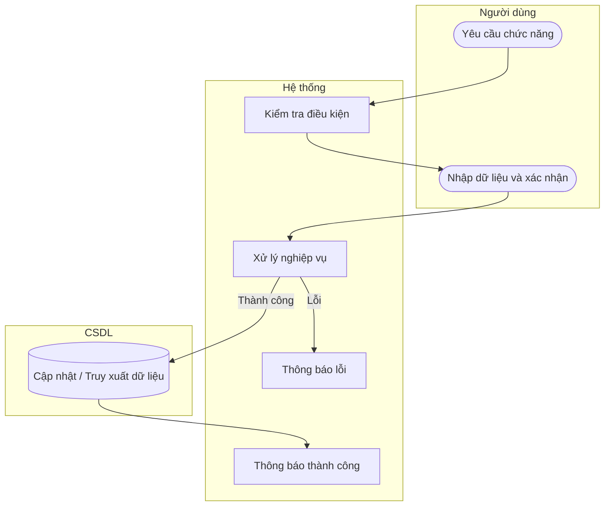

# UC28 — Sửa sản phẩm

| Thành phần | Nội dung |
|:---|:---|
| **Tên Use-case** | Sửa sản phẩm |
| **Mô tả** | Thay đổi giá bán, cập nhật lại hình ảnh hoặc thông tin mô tả của sản phẩm đang kinh doanh. |
| **Actors** | Quản lý |
| **Tiền điều kiện** | Đã chọn sản phẩm cần sửa. |
| **Hậu điều kiện** | Thông tin sản phẩm được cập nhật. |

## Luồng sự kiện chính

1. Quản lý chọn sửa thông tin sản phẩm.
2. Hệ thống hiển thị thông hiện tại.
3. Quản lý thay đổi giá hoặc thông tin, nhấn lưu.
4. Hệ thống lưu các thay đổi.
5. Hệ thống thông báo thành công.

## Luồng sự kiện lỗi

- Dữ liệu không hợp lệ (giá < 0): Báo lỗi.

## Activity Diagram

