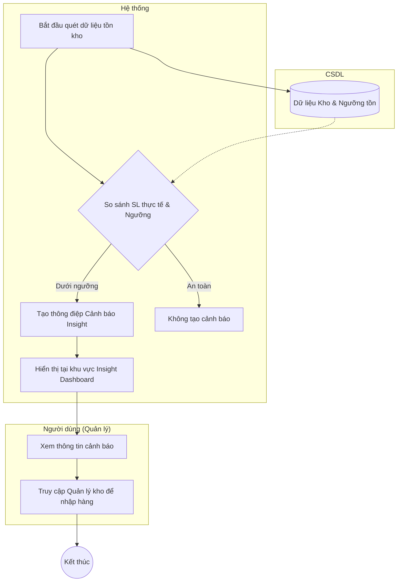

# Đặc tả Use-case: UC29 - Cảnh báo tồn kho

| Thành phần | Nội dung |
|:---|:---|
| **Tên Use-case** | **Cảnh báo tồn kho** |
| **Mô tả Use-case** | Hệ thống tự động phân tích dữ liệu tồn kho để đưa ra các gợi ý và cảnh báo cho người quản lý về việc nhập thêm nguyên liệu hoặc đẩy mạnh bán các mặt hàng sắp hết hạn. |
| **Actors** | Hệ thống, Quản lý cửa hàng |
| **Tiền điều kiện** | Hệ thống có dữ liệu về tồn kho thực tế và ngưỡng tồn tối thiểu đã thiết lập. |
| **Hậu điều kiện** | Các cảnh báo được hiển thị nổi bật trên màn hình Dashboard/Reports. |
| **Luồng sự kiện chính** | 1. Hệ thống thực hiện quét dữ liệu tồn kho sau mỗi giao dịch hoặc định kỳ hàng ngày. 2. Hệ thống so sánh số lượng thực tế với định mức tối thiểu. 3. Nếu dưới ngưỡng, hệ thống tạo một thông điệp cảnh báo (Insight). 4. Quản lý truy cập vào màn hình "Báo cáo & Thống kê". 5. Hệ thống hiển thị các cảnh báo quan trọng tại khu vực "Gợi ý từ bếp trưởng" (ví dụ: Bột lúa mạch đen dưới 15%). 6. Quản lý nhấn vào nút "Quản lý nguyên liệu" để tiến hành xử lý (nhập thêm hàng). |
| **Luồng sự kiện phụ** | 3a. Hệ thống cũng gợi ý các cơ hội khuyến mãi dựa trên khung giờ bán chạy của từng sản phẩm. |

## Activity Diagram (Sơ đồ hoạt động)

