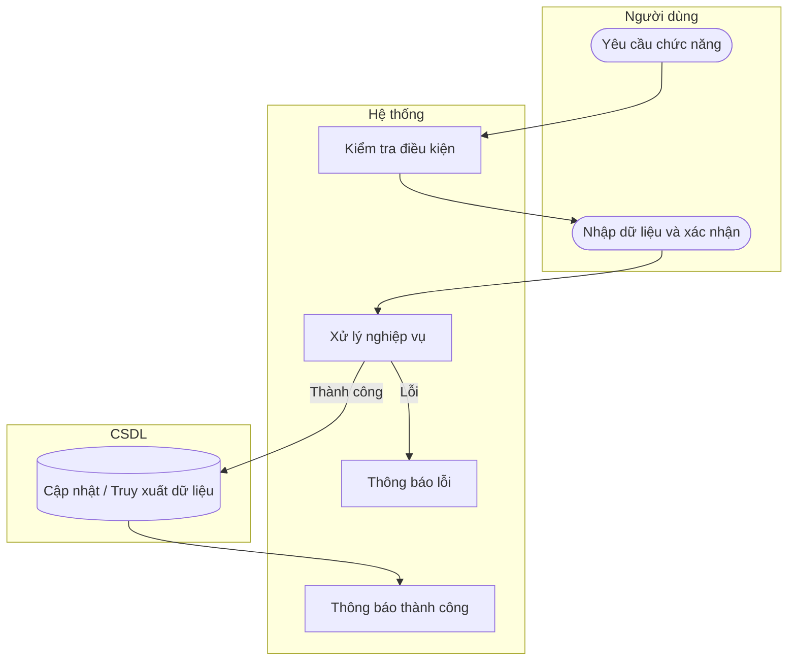

# UC30 — Tra cứu sản phẩm

| Thành phần | Nội dung |
|:---|:---|
| **Tên Use-case** | Tra cứu sản phẩm |
| **Mô tả** | Tìm kiếm và xem thông tin giá bán, hình ảnh của sản phẩm phục vụ cho việc tư vấn tại quầy. |
| **Actors** | Quản lý, Thu ngân |
| **Tiền điều kiện** | Đã đăng nhập hệ thống. |
| **Hậu điều kiện** | Kết quả tìm kiếm hiển thị danh sách sản phẩm. |

## Luồng sự kiện chính

1. Người dùng nhập tên sản phẩm hoặc mã sản phẩm.
2. Hệ thống lọc dữ liệu theo thời gian thực.
3. Hệ thống hiển thị kết quả bao gồm tên, giá, hình ảnh.

## Luồng sự kiện lỗi

- Không có ngoại lệ đặc biệt.

## Activity Diagram

