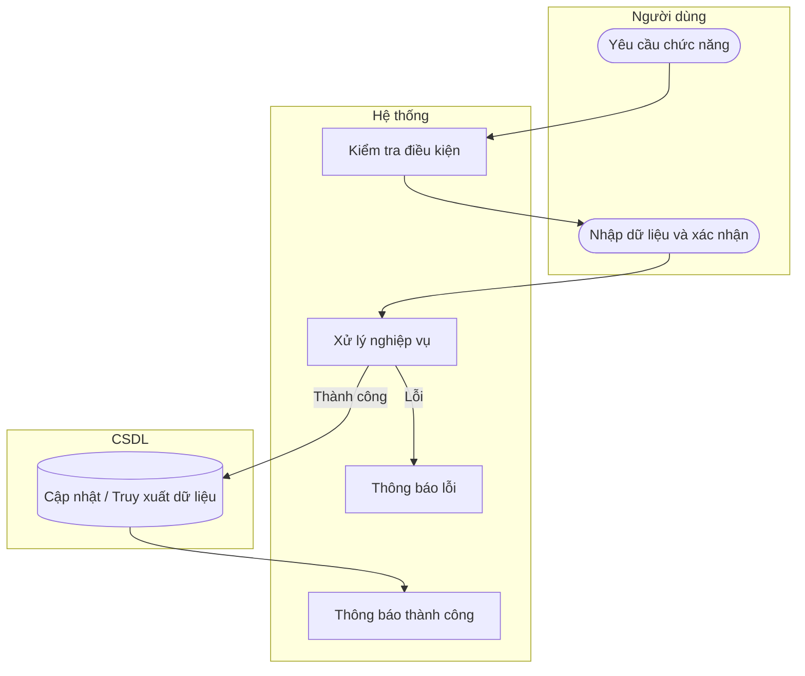

# UC31 — Thêm công thức

| Thành phần | Nội dung |
|:---|:---|
| **Tên Use-case** | Thêm công thức |
| **Mô tả** | Khởi tạo bảng định lượng các thành phần nguyên liệu chuẩn xác cho một loại bánh mới. |
| **Actors** | Quản lý |
| **Tiền điều kiện** | Sản phẩm đã tồn tại nhưng chưa có công thức. |
| **Hậu điều kiện** | Công thức mới được tạo và liên kết với sản phẩm. |

## Luồng sự kiện chính

1. Quản lý chọn chức năng thêm công thức cho sản phẩm.
2. Hệ thống hiển thị form chọn nguyên liệu.
3. Quản lý chọn nguyên liệu và định lượng tương ứng.
4. Quản lý nhấn lưu.
5. Hệ thống kiểm tra tính hợp lệ và lưu công thức.
6. Hệ thống thông báo thành công.

## Luồng sự kiện lỗi

- Nguyên liệu trống hoặc định lượng <= 0: Báo lỗi.

## Activity Diagram

