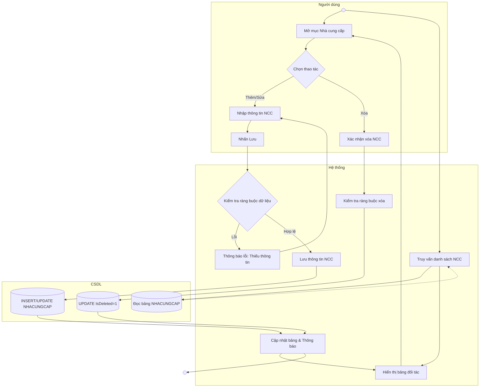

# Đặc tả Use-case: UC32 - Quản lý nhà cung cấp

| Thành phần | Nội dung |
|:---|:---|
| **Tên Use-case** | **Quản lý nhà cung cấp** |
| **Mô tả Use-case** | Quản lý thông tin các đơn vị cung cấp nguyên liệu đầu vào cho tiệm bánh (Tên NCC, Địa chỉ, SĐT). |
| **Actors** | Thủ kho, Quản lý cửa hàng |
| **Tiền điều kiện** | Người dùng đã đăng nhập hệ thống. |
| **Hậu điều kiện** | Danh sách NCC được cập nhật để phục vụ việc lập phiếu nhập kho. |
| **Luồng sự kiện chính** | 1. Người dùng mở mục "Nhà cung cấp". 2. Hệ thống hiển thị danh sách các đối tác hiện tại. 3. Người dùng thực hiện Thêm mới hoặc Sửa thông tin nhà cung cấp. 4. Hệ thống kiểm tra các thông tin bắt buộc (Tên, SĐT). 5. Hệ thống thực hiện lưu dữ liệu vào bảng NHACUNGCAP. 6. Hệ thống hiển thị thông báo thành công và làm mới bảng. |

## Activity Diagram (Sơ đồ hoạt động)

