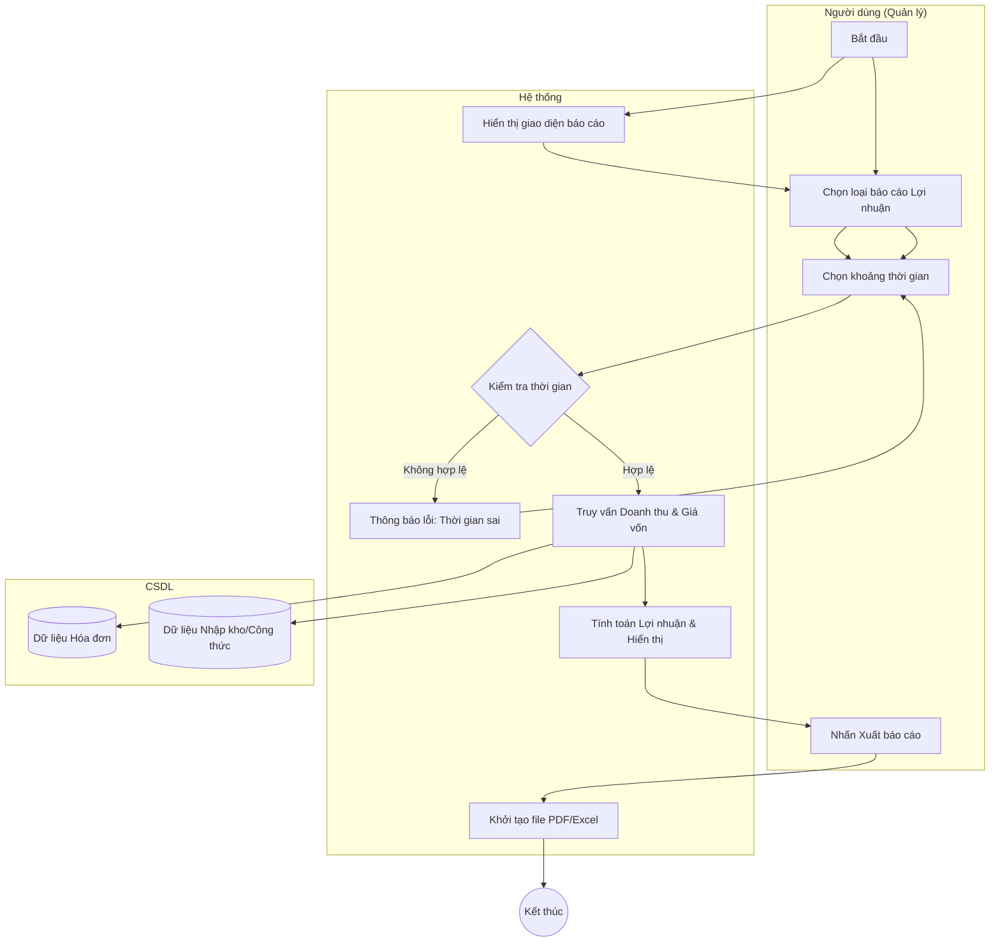

# Đặc tả Use-case: UC34 - Báo cáo lợi nhuận

| Thành phần | Nội dung |
|:---|:---|
| **Tên Use-case** | **Báo cáo lợi nhuận** |
| **Mô tả Use-case** | Hệ thống tổng hợp doanh thu và chi phí (giá vốn, chi phí vận hành) để tính toán lợi nhuận thực tế theo khoảng thời gian. |
| **Actors** | Quản lý cửa hàng |
| **Tiền điều kiện** | Quản lý đã đăng nhập vào hệ thống. |
| **Hậu điều kiện** | Báo cáo lợi nhuận được hiển thị dưới dạng bảng biểu hoặc biểu đồ, hỗ trợ xuất file. |
| **Luồng sự kiện chính** | 1. Quản lý truy cập vào mục "Báo cáo & Thống kê". 2. Chọn loại báo cáo "Lợi nhuận". 3. Chọn khoảng thời gian (Từ ngày - Đến ngày) cần xem. 4. Hệ thống truy vấn dữ liệu doanh thu từ hóa đơn và chi phí từ phiếu nhập kho/công thức. 5. Hệ thống thực hiện tính toán: Lợi nhuận = Doanh thu - Giá vốn. 6. Hệ thống hiển thị kết quả lên màn hình. |
| **Luồng sự kiện phụ** | 6a. Quản lý có thể chọn "Xuất báo cáo" để tải file định dạng PDF hoặc Excel. |
| **Luồng sự kiện lỗi hoặc ngoại lệ** | - Nếu trong khoảng thời gian chọn không có dữ liệu giao dịch, hệ thống hiển thị thông báo "Không có dữ liệu để báo cáo". - Nếu ngày kết thúc nhỏ hơn ngày bắt đầu, hệ thống báo lỗi khoảng thời gian không hợp lệ. |

## Activity Diagram (Sơ đồ hoạt động)

