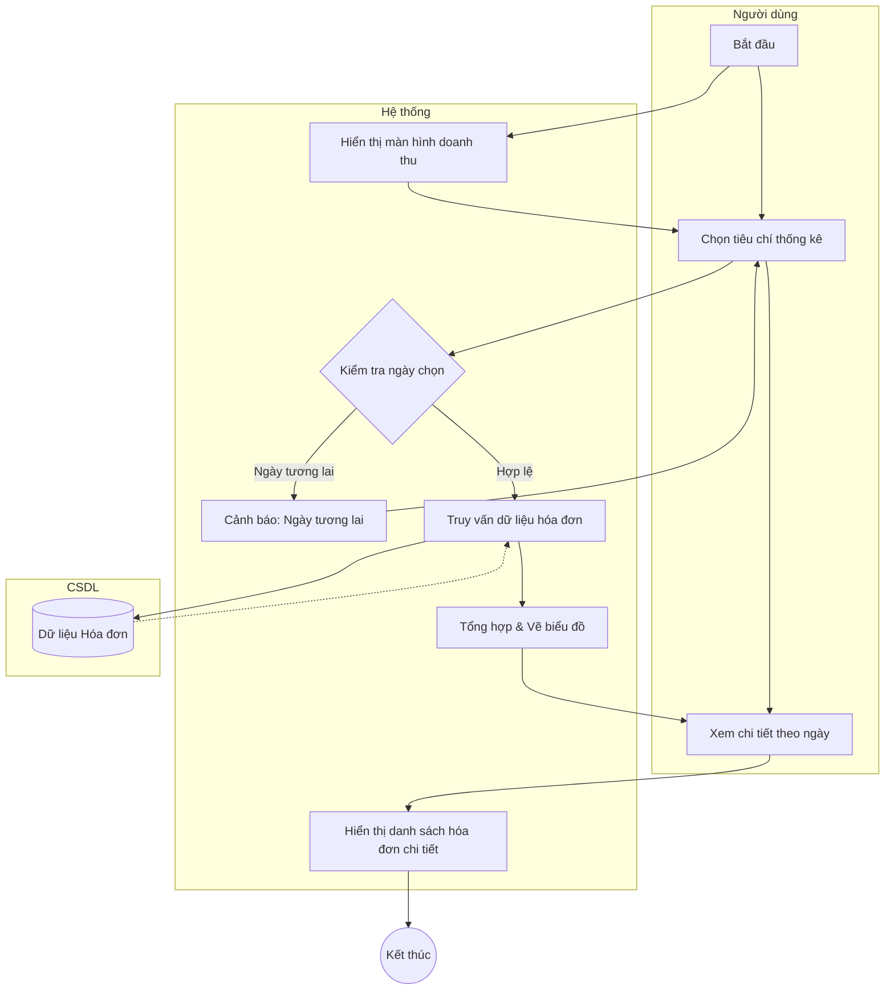

# Đặc tả Use-case: UC35 - Báo cáo doanh thu

| Thành phần | Nội dung |
|:---|:---|
| **Tên Use-case** | **Báo cáo doanh thu** |
| **Mô tả Use-case** | Hệ thống thống kê tổng số tiền thu được từ việc bán hàng và đặt đơn trong một khoảng thời gian nhất định. |
| **Actors** | Quản lý cửa hàng, Thu ngân |
| **Tiền điều kiện** | Người dùng đã đăng nhập vào hệ thống. |
| **Hậu điều kiện** | Biểu đồ doanh thu và danh sách chi tiết các hóa đơn được hiển thị. |
| **Luồng sự kiện chính** | 1. Người dùng truy cập mục "Báo cáo doanh thu". 2. Chọn tiêu chí thống kê (theo ngày, tháng, hoặc khoảng thời gian). 3. Hệ thống truy vấn toàn bộ các hóa đơn đã thanh toán thành công trong kỳ. 4. Hệ thống tổng hợp tiền theo từng hình thức (Tiền mặt, Chuyển khoản). 5. Hệ thống hiển thị biểu đồ tăng trưởng doanh thu và bảng kê chi tiết. |
| **Luồng sự kiện phụ** | 5a. Người dùng có thể nhấn vào một cột trên biểu đồ để xem chi tiết các giao dịch của ngày đó. |
| **Luồng sự kiện lỗi hoặc ngoại lệ** | - Nếu hệ thống mất kết nối CSDL, hiển thị thông báo lỗi "Không thể truy xuất dữ liệu". - Nếu chọn ngày ở tương lai, hệ thống cảnh báo và yêu cầu chọn lại. |

## Activity Diagram (Sơ đồ hoạt động)

