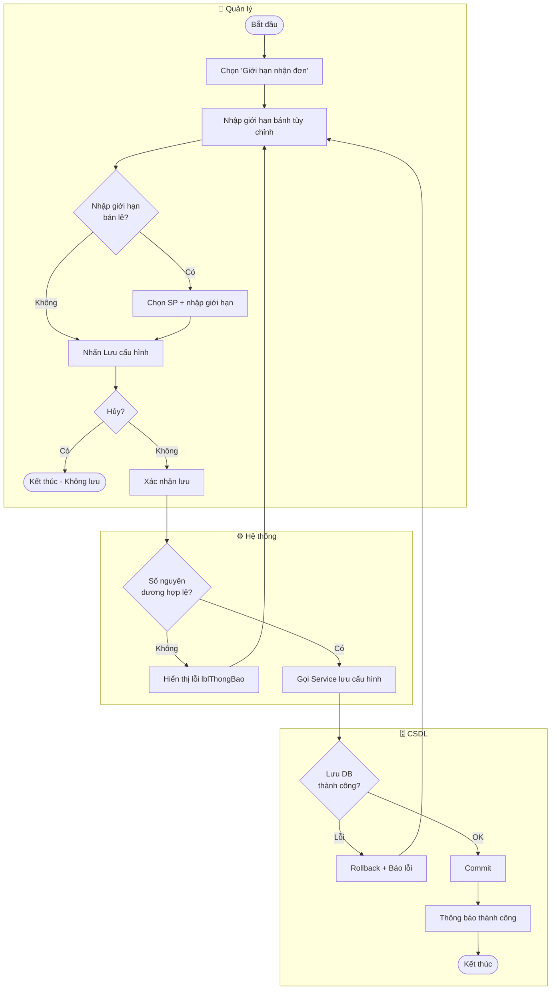

# UC36 — Cấu hình giới hạn nhận đơn

| Thành phần | Nội dung |
|:---|:---|
| **Tên Use-case** | Cấu hình giới hạn nhận đơn |
| **Mô tả Use-case** | Quản lý thiết lập số lượng bánh tối đa mà bếp có thể sản xuất trong một ngày để kiểm soát việc nhận đơn. Áp dụng riêng cho bánh tùy chỉnh (giới hạn theo số đơn/ngày) và bánh bán lẻ (giới hạn theo số lượng từng sản phẩm/ngày). |
| **Actors** | Quản lý |
| **Tiền điều kiện** | Quản lý đã đăng nhập và được cấp quyền `CAU_HINH_GIOI_HAN_DON` (module BAO_CAO). |
| **Hậu điều kiện** | Cấu hình giới hạn nhận đơn được cập nhật trong hệ thống. Các đơn đặt hàng mới sẽ chịu sự kiểm soát của giới hạn này. |
| **Luồng sự kiện chính** | 1. Quản lý chọn chức năng "Giới hạn nhận đơn" trên Navigation Bar (dưới mục Thống kê & BC).  2. Hệ thống hiển thị màn hình `CauHinhGioiHanDonView` với bảng cấu hình hiện tại và biểu mẫu nhập liệu.  3. Quản lý nhập số lượng đơn bánh tùy chỉnh tối đa (VD: 50 đơn/ngày).  4. (Tuỳ chọn) Quản lý chọn sản phẩm bán lẻ và nhập giới hạn số lượng (VD: 100 cái/ngày).  5. Quản lý nhấn "Lưu cấu hình".  6. Hệ thống kiểm tra: số lượng phải là số nguyên dương hợp lệ.  7. Hệ thống lưu cấu hình mới vào DB.  8. Hệ thống thông báo "Cập nhật cấu hình thành công." |
| **Luồng sự kiện phụ** | 4a. Quản lý nhấn "Hủy" → hệ thống xóa form, không lưu dữ liệu. |
| **Luồng sự kiện lỗi / ngoại lệ** | Bước 6: Số lượng không hợp lệ (không phải số nguyên dương) → hệ thống hiển thị lỗi ở `lblThongBao`, giữ nguyên biểu mẫu.  Bước 7: Lỗi kết nối DB / lỗi lưu → hệ thống báo lỗi qua `lblThongBao`, dữ liệu không thay đổi, giao dịch bị rollback. |

---

## Activity Diagram

---

## Ghi chú triển khai

| Layer | File | Trạng thái |
|---|---|---|
| View (FXML) | `CauHinhGioiHanDonView.fxml` | ✅ Tạo mới |
| Controller | `CauHinhGioiHanDonViewFXMLController.java` | ✅ Stub — chờ Presenter |
| Presenter | `CauHinhGioiHanPresenter.java` | ⏳ Chưa xây dựng |
| Service | `CauHinhGioiHanService.java` | ⏳ Chưa xây dựng |
| DAO | `CauHinhGioiHanDAO.java` | ⏳ Chưa xây dựng |
| DB Procedure | `PROC_CAU_HINH_GIOI_HAN` | ⏳ Chưa xây dựng |
| DB Table | `CAUHINH_GIOI_HAN_DON` | ⏳ Cần thiết kế schema |

> **Lưu ý:** Controller hiện là stub validation UI. Khi xây dựng Presenter+Service+DAO, inject vào `initialize()` theo chuẩn MVP.
