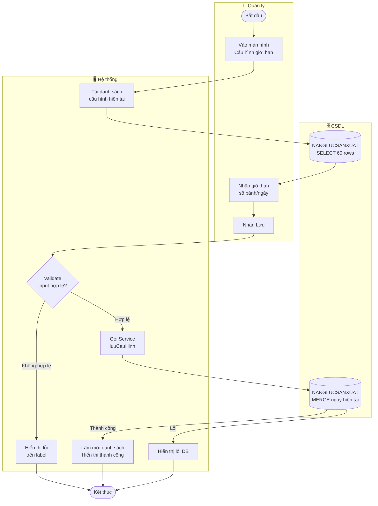

# UC37 — Cấu hình giới hạn nhận đơn

| Thành phần | Nội dung |
|:---|:---|
| **Tên Use-case** | Cấu hình giới hạn nhận đơn |
| **Mô tả Use-case** | Quản lý thiết lập số lượng bánh tối đa bếp có thể sản xuất trong một ngày để hệ thống tự động từ chối đơn vượt công suất. |
| **Actors** | Quản lý |
| **Tiền điều kiện** | Quản lý đã đăng nhập với quyền truy cập cấu hình hệ thống. |
| **Hậu điều kiện** | Bảng `NANGLUCSANXUAT` được cập nhật với giới hạn mới cho ngày được chọn. Trigger `TRG_KIEMSOAT_CONGSUAT_DONHANG` sẽ tự động áp dụng giới hạn này khi có đơn mới. |
| **Luồng sự kiện chính** | 1. Quản lý vào màn hình **Cấu hình giới hạn nhận đơn**. 2. Hệ thống tải và hiển thị danh sách cấu hình hiện tại (60 bản ghi gần nhất). 3. Quản lý nhập số lượng bánh tối đa vào trường **"Giới hạn bánh tùy chỉnh"**. 4. Quản lý nhấn **"💾 Lưu cấu hình"**. 5. Hệ thống validate input (số nguyên dương). 6. Hệ thống thực hiện UPSERT vào `NANGLUCSANXUAT` cho ngày hiện tại. 7. Hệ thống làm mới danh sách và hiển thị thông báo thành công. |
| **Luồng sự kiện phụ** | **3a.** Quản lý không nhập gì → nhấn Hủy → hệ thống xóa form, không thay đổi DB. |
| **Luồng sự kiện lỗi hoặc ngoại lệ** | **Bước 5:** Input không phải số nguyên dương → hệ thống hiển thị lỗi trên label, không gọi DB. **Bước 6:** Lỗi DB → hệ thống hiển thị thông báo lỗi, trạng thái DB không thay đổi. |

---

## Activity Diagram

---

## Ghi chú kỹ thuật

| Tầng | Class | Method |
|---|---|---|
| View | `CauHinhGioiHanDonViewFXMLController` | `onLuuCauHinh()` |
| Presenter | `CauHinhGioiHanPresenter` | `luuCauHinhTuyChinh(str)` |
| Service | `CauHinhGioiHanService` | `luuCauHinh(ngay, gioiHan)` |
| DAO | `CauHinhGioiHanDAO` | `luuCauHinh(ngay, gioiHan)` |
| DB | `NANGLUCSANXUAT` | `MERGE INTO` (upsert) |
| DB Trigger | `TRG_KIEMSOAT_CONGSUAT_DONHANG` | Auto-enforce khi INSERT CTDONHANG |
