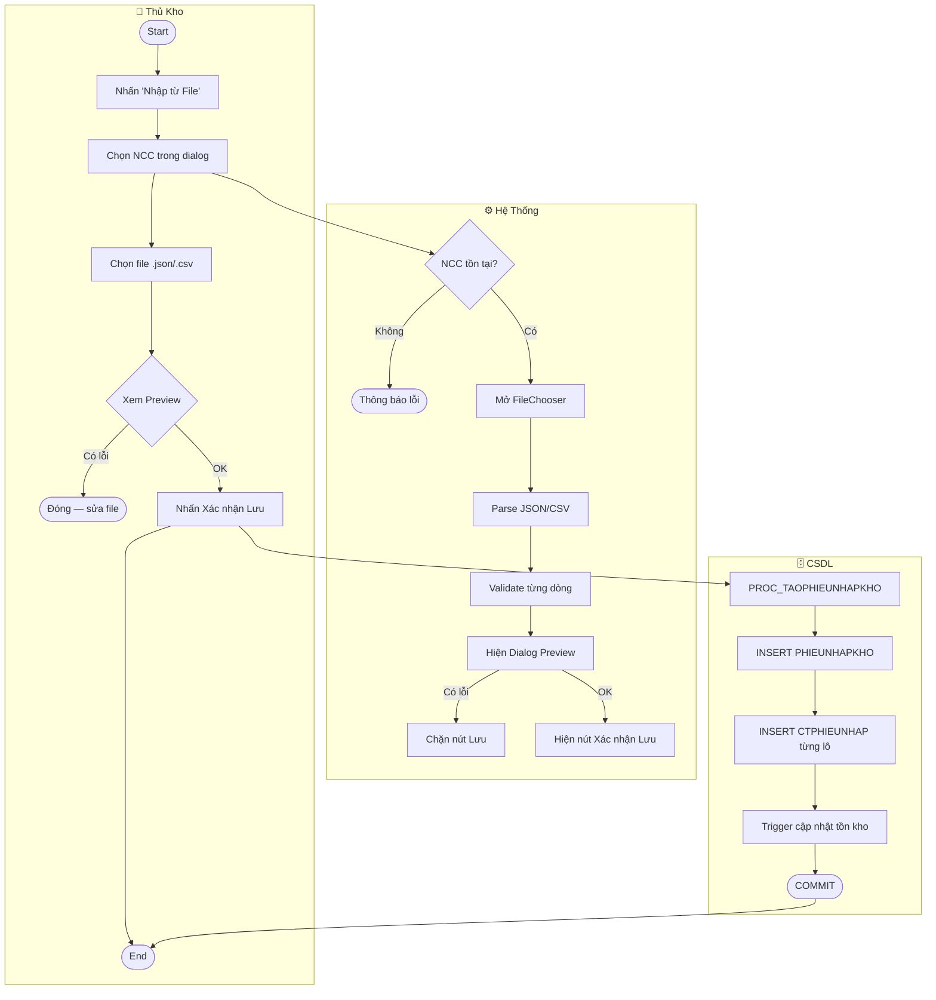

# UC38 — Nhập Kho Tự Động Từ File

| Thành phần | Nội dung |
|:---|:---|
| **Tên Use-case** | Nhập kho tự động từ file JSON / CSV |
| **Mô tả Use-case** | Thủ kho tải lên file danh sách lô hàng, hệ thống tự động validate và lưu vào DB mà không cần nhập tay từng dòng |
| **Actors** | Thủ kho (Kho viên) |
| **Tiền điều kiện** | Đã đăng nhập; Đã có ít nhất 1 Nhà cung cấp trong hệ thống |
| **Hậu điều kiện** | Phiếu nhập kho được tạo; Tồn kho nguyên liệu được cập nhật tự động qua Trigger |
| **Luồng sự kiện chính** | 1. Thủ kho nhấn "📂 Nhập từ File" trên màn hình Quản lý Nhập Kho<br>2. Hệ thống hiện dialog chọn Nhà cung cấp<br>3. Thủ kho chọn NCC và xác nhận<br>4. Hệ thống mở FileChooser — lọc `.json` và `.csv`<br>5. Thủ kho chọn file<br>6. Hệ thống parse file và chạy validate toàn bộ<br>7. Hệ thống hiện dialog Preview: bảng dữ liệu đọc được và danh sách lỗi<br>8. Thủ kho xem xét và nhấn "✅ Xác nhận Lưu"<br>9. Hệ thống gọi `PROC_TAOPHIEUNHAPKHO` → tạo phiếu nhập và cập nhật kho<br>10. Hệ thống thông báo thành công, reload bảng lịch sử phiếu nhập |
| **Luồng sự kiện phụ** | 3a. Chưa có NCC → thông báo "Hãy thêm nhà cung cấp trước"<br>5a. Thủ kho đóng FileChooser → hủy flow<br>6a. File định dạng sai (không phải json/csv) → thông báo lỗi<br>7a. Có lỗi validate → chỉ hiện nút "Đóng", không cho lưu |
| **Luồng sự kiện lỗi** | 9a. Lỗi DB → hiển thị thông báo lỗi chi tiết từ procedure, không lưu gì |

## Validate Rules
| Rule | Điều kiện | Hành động |
|---|---|---|
| V1 | `tenNL` rỗng khi `maNL = 0` | Lỗi — chặn lưu |
| V2 | `soLuong <= 0` | Lỗi — chặn lưu |
| V3 | `donGia <= 0` | Lỗi — chặn lưu |
| V4 | `hanSuDung` < ngày hôm nay | Lỗi — chặn lưu |
| V5 | File rỗng (0 dòng dữ liệu) | Lỗi — chặn lưu |

## Format File Hỗ Trợ
### JSON
```json
[
  { "maNL": 5, "tenNL": "Bột mì", "xuatXu": "VN", "maDVT": 1,
    "soLuong": 50.0, "donGia": 25000, "ngaySanXuat": "2025-01-01", "hanSuDung": "2026-01-01" },
  { "maNL": 0, "tenNL": "Đường vàng mới", "xuatXu": "", "maDVT": 2,
    "soLuong": 20.0, "donGia": 18000, "ngaySanXuat": "", "hanSuDung": "2026-06-01" }
]
```
> `maNL = 0` → procedure tự động tạo nguyên liệu mới

### CSV (UTF-8, hỗ trợ BOM từ Excel)
```csv
maNL,tenNL,xuatXu,maDVT,soLuong,donGia,ngaySanXuat,hanSuDung
5,Bột mì,VN,1,50.0,25000,2025-01-01,2026-01-01
0,Đường vàng mới,,2,20.0,18000,,2026-06-01
```

---

## Activity Diagram


