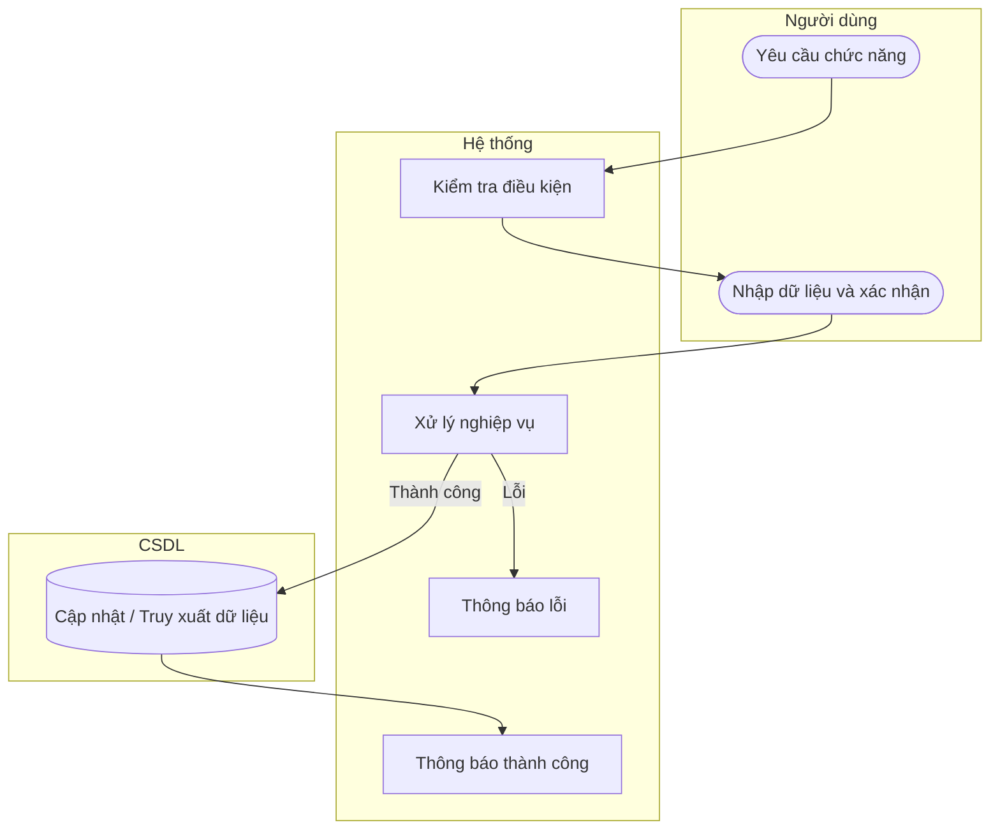

# UC39 — Cập nhật trạng thái nguyên liệu

| Thành phần | Nội dung |
|:---|:---|
| **Tên Use-case** | Cập nhật trạng thái nguyên liệu |
| **Mô tả** | Vô hiệu hóa nguyên liệu không còn sử dụng để ẩn khỏi biểu mẫu lập phiếu nhập hoặc xuất kho, giữ nguyên vẹn lịch sử thẻ kho và giá trị tồn kho cũ. |
| **Actors** | Thủ kho, Quản lý |
| **Tiền điều kiện** | Đã chọn nguyên liệu. |
| **Hậu điều kiện** | Trạng thái được cập nhật, dữ liệu lịch sử giữ nguyên. |

## Luồng sự kiện chính

1. Người dùng chọn đổi trạng thái nguyên liệu.
2. Hệ thống hiển thị hộp thoại xác nhận.
3. Người dùng xác nhận thao tác.
4. Hệ thống vô hiệu hóa nguyên liệu.
5. Hệ thống thông báo thành công.

## Luồng sự kiện lỗi

- Không có ngoại lệ đặc biệt.

## Activity Diagram

