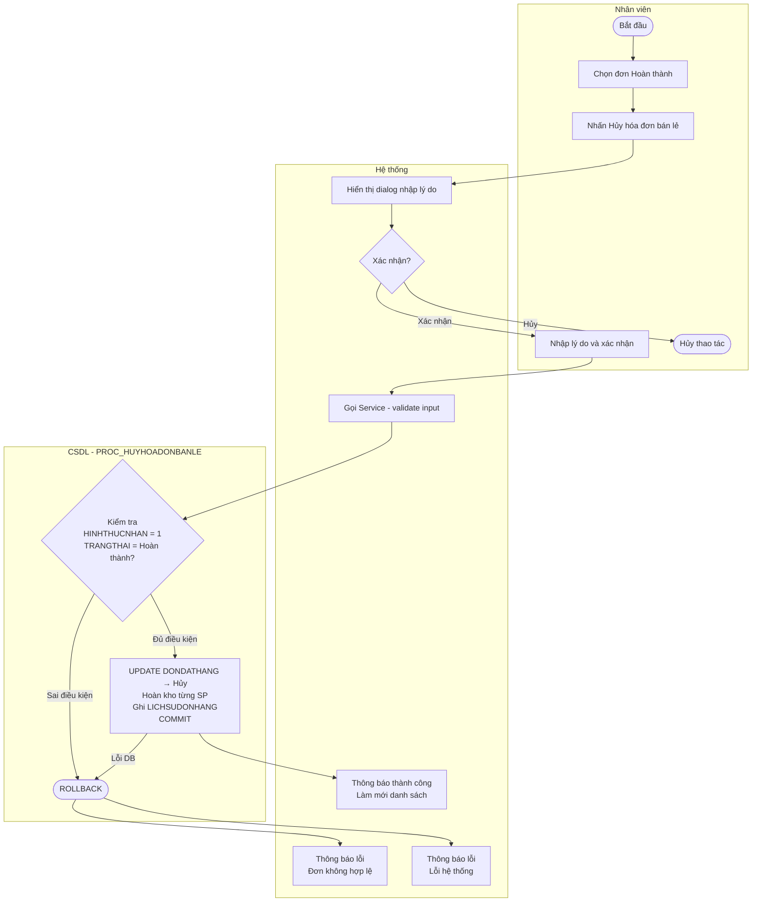

# Đặc tả Use-case: UC40 - Hủy hóa đơn bán lẻ

| Thành phần | Nội dung |
|:---|:---|
| **Tên Use-case** | **Hủy hóa đơn bán lẻ** |
| **Mô tả Use-case** | Nhân viên xử lý hủy hóa đơn bán lẻ đã hoàn thành. Hệ thống tự động hoàn kho và ghi lịch sử hủy. Tiền mặt hoàn trả khách do quản lý xử lý ngoài hệ thống. |
| **Actors** | Quản lý, Thu ngân |
| **Tiền điều kiện** | - Nhân viên đã đăng nhập và có quyền xử lý đơn.<br>- Đơn hàng cần hủy đang tồn tại trên hệ thống với trạng thái **Hoàn thành**.<br>- Đơn phải là hình thức bán trực tiếp tại quầy (không áp dụng cho đơn đặt trước). |
| **Hậu điều kiện** | - Trạng thái đơn hàng được chuyển sang **Hủy**.<br>- Số lượng tồn kho của từng sản phẩm trong đơn được cộng trả lại.<br>- Lịch sử hủy được ghi vào `LICHSUDONHANG` với lý do hủy. |
| **Luồng sự kiện chính** | 1. Nhân viên chọn đơn hàng cần hủy từ danh sách theo dõi.<br>2. Nhân viên nhấn chức năng **Hủy hóa đơn bán lẻ**.<br>3. Hệ thống hiển thị dialog xác nhận — yêu cầu nhập lý do hủy.<br>4. Nhân viên nhập lý do và xác nhận.<br>5. Hệ thống kiểm tra đơn có đủ điều kiện hủy (trạng thái Hoàn thành, hình thức trực tiếp).<br>6. Hệ thống chuyển trạng thái đơn → Hủy, hoàn kho từng sản phẩm, ghi lịch sử.<br>7. Hệ thống thông báo thành công và làm mới danh sách đơn. |
| **Luồng sự kiện phụ** | 4a. Nhân viên nhấn **Hủy thao tác** — dialog đóng, đơn hàng không thay đổi. |
| **Luồng sự kiện lỗi hoặc ngoại lệ** | - **Bước 5 — Sai trạng thái:** Đơn không ở trạng thái Hoàn thành → DB raise ORA-20xxx, hệ thống báo lỗi, từ chối thực hiện.<br>- **Bước 5 — Sai hình thức:** Đơn là đặt trước (không phải bán lẻ) → DB raise ORA-20xxx, hệ thống báo lỗi.<br>- **Bước 6 — Lỗi lưu:** Lỗi DB → ROLLBACK tự động, đơn hàng không thay đổi, hệ thống báo lỗi. |

## Luồng kỹ thuật

```
Presenter.huyHoaDonBanLe(maDonStr)
  → dialogFactory.showCancelOrderDialog() — nhập lý do
  → DonHangService.huyHoaDonBanLe(maDon, lyDo, maNV)
    → QuanLyDonHangService.huyHoaDonBanLe() — validate input
      → DonHangDAO.huyHoaDonBanLe()
        → PROC_HUYHOADONBANLE(maDon, lyDo, maNV)
          → Kiểm tra HINHTHUCNHAN = 1
          → Kiểm tra TRANGTHAIDON = Hoàn thành
          → UPDATE DONDATHANG → Hủy
          → FOR LOOP: UPDATE SANPHAM.SOLUONGTON +
          → INSERT LICHSUDONHANG
          → COMMIT
```

## Activity Diagram


