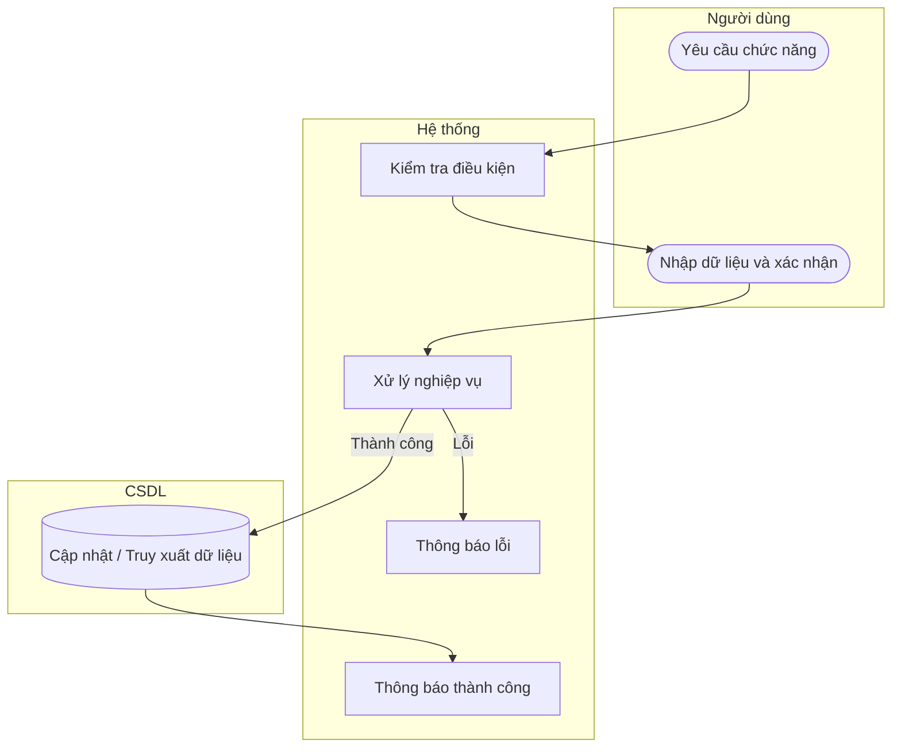

# UC41 — Lập phiếu xuất kho

| Thành phần | Nội dung |
|:---|:---|
| **Tên Use-case** | Lập phiếu xuất kho |
| **Mô tả** | Trừ số lượng nguyên liệu trong kho khi thợ bếp xuất đồ đi làm bánh. |
| **Actors** | Thủ kho, Thợ bếp |
| **Tiền điều kiện** | Đã đăng nhập hệ thống. Kho có đủ nguyên liệu để xuất. |
| **Hậu điều kiện** | Phiếu xuất kho được lưu, số lượng tồn kho giảm tương ứng. |

## Luồng sự kiện chính

1. Người dùng chọn chức năng lập phiếu xuất kho.
2. Hệ thống hiển thị danh sách nguyên liệu và form lập phiếu.
3. Người dùng chọn nguyên liệu và nhập số lượng cần xuất.
4. Người dùng xác nhận lập phiếu.
5. Hệ thống kiểm tra tồn kho và lưu phiếu xuất kho.
6. Hệ thống thông báo xuất kho thành công.

## Luồng sự kiện lỗi

- Tồn kho không đủ: Hệ thống cảnh báo và từ chối xuất.
- Dữ liệu nhập sai: Hệ thống báo lỗi.

## Activity Diagram

