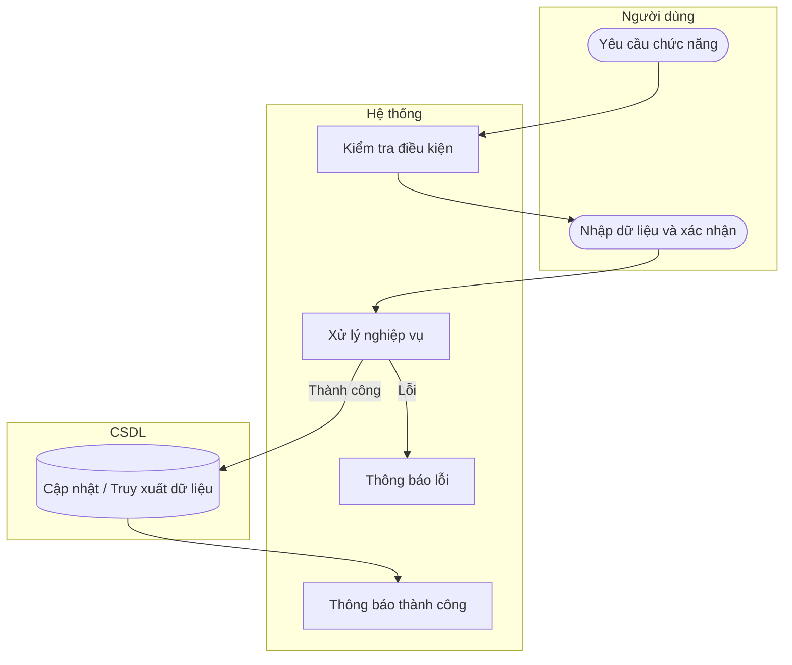

# UC44 — Tra cứu thẻ kho

| Thành phần | Nội dung |
|:---|:---|
| **Tên Use-case** | Tra cứu thẻ kho |
| **Mô tả** | Xem lại toàn bộ lịch sử biến động (nhập/xuất/tồn) của một loại nguyên liệu trong quá khứ. |
| **Actors** | Thủ kho, Quản lý |
| **Tiền điều kiện** | Đã đăng nhập hệ thống. |
| **Hậu điều kiện** | Hiển thị chính xác thông tin lịch sử nguyên liệu. |

## Luồng sự kiện chính

1. Người dùng chọn chức năng tra cứu thẻ kho.
2. Hệ thống hiển thị danh sách nguyên liệu.
3. Người dùng chọn nguyên liệu và khoảng thời gian cần xem.
4. Hệ thống truy xuất dữ liệu biến động kho.
5. Hệ thống hiển thị báo cáo chi tiết lịch sử nhập xuất.

## Luồng sự kiện lỗi

- Lỗi truy xuất: Hệ thống báo lỗi.

## Activity Diagram

