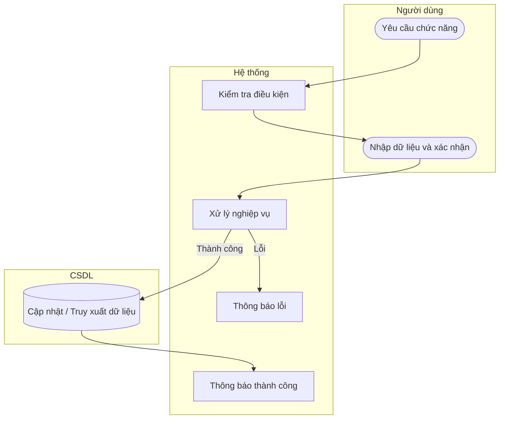

# UC46 — Thêm nhà cung cấp

| Thành phần | Nội dung |
|:---|:---|
| **Tên Use-case** | Thêm nhà cung cấp |
| **Mô tả** | Khởi tạo hồ sơ đối tác cung cấp nguyên liệu mới bao gồm tên công ty và thông tin liên hệ. |
| **Actors** | Thủ kho, Quản lý |
| **Tiền điều kiện** | Đã đăng nhập hệ thống. |
| **Hậu điều kiện** | Thông tin nhà cung cấp mới được lưu vào hệ thống. |

## Luồng sự kiện chính

1. Người dùng chọn chức năng thêm nhà cung cấp.
2. Người dùng nhập thông tin: tên, số điện thoại, địa chỉ.
3. Người dùng xác nhận lưu.
4. Hệ thống kiểm tra thông tin và lưu dữ liệu.
5. Hệ thống thông báo thành công và làm mới danh sách.

## Luồng sự kiện lỗi

- Thiếu thông tin: Báo lỗi yêu cầu điền đủ.
- Trùng số điện thoại: Báo lỗi trùng lặp.

## Activity Diagram

