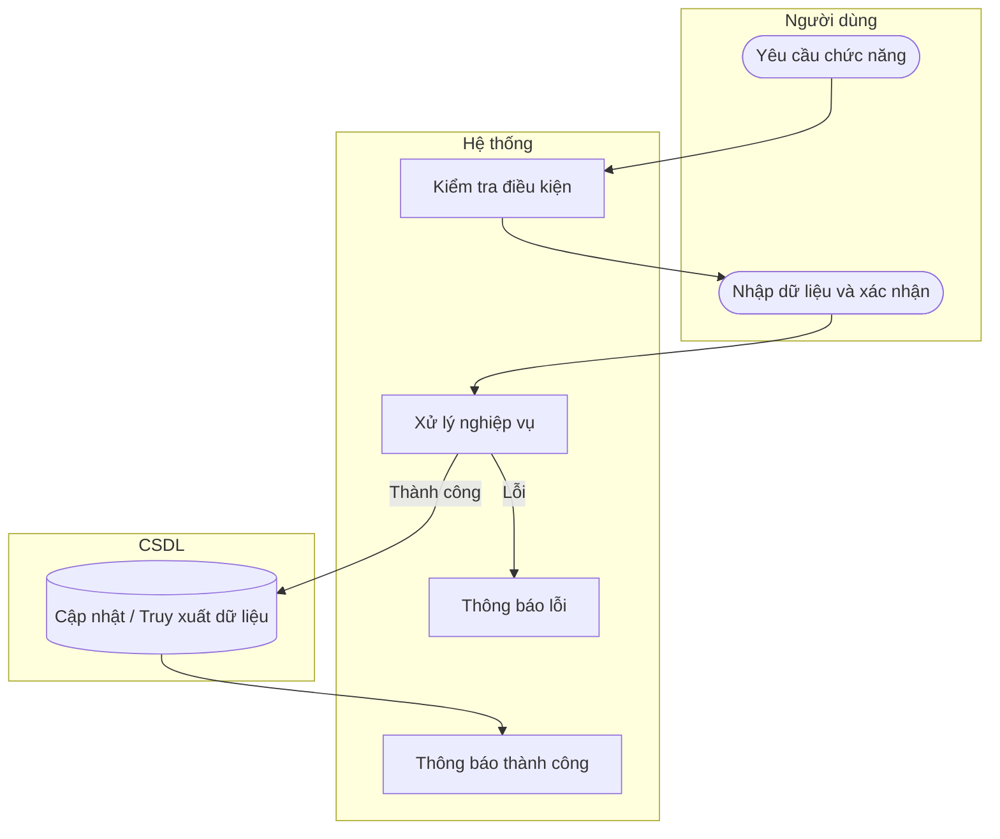

# UC47 — Sửa nhà cung cấp

| Thành phần | Nội dung |
|:---|:---|
| **Tên Use-case** | Sửa nhà cung cấp |
| **Mô tả** | Thay đổi địa chỉ, số điện thoại hoặc người đại diện của đối tác cung cấp hiện tại. |
| **Actors** | Thủ kho, Quản lý |
| **Tiền điều kiện** | Đã chọn nhà cung cấp cần sửa. |
| **Hậu điều kiện** | Thông tin được cập nhật chính xác. |

## Luồng sự kiện chính

1. Người dùng chọn chức năng sửa thông tin nhà cung cấp.
2. Hệ thống hiển thị thông tin hiện tại.
3. Người dùng thay đổi thông tin và xác nhận lưu.
4. Hệ thống kiểm tra và cập nhật dữ liệu.
5. Hệ thống thông báo thành công.

## Luồng sự kiện lỗi

- Thiếu thông tin: Báo lỗi.

## Activity Diagram

