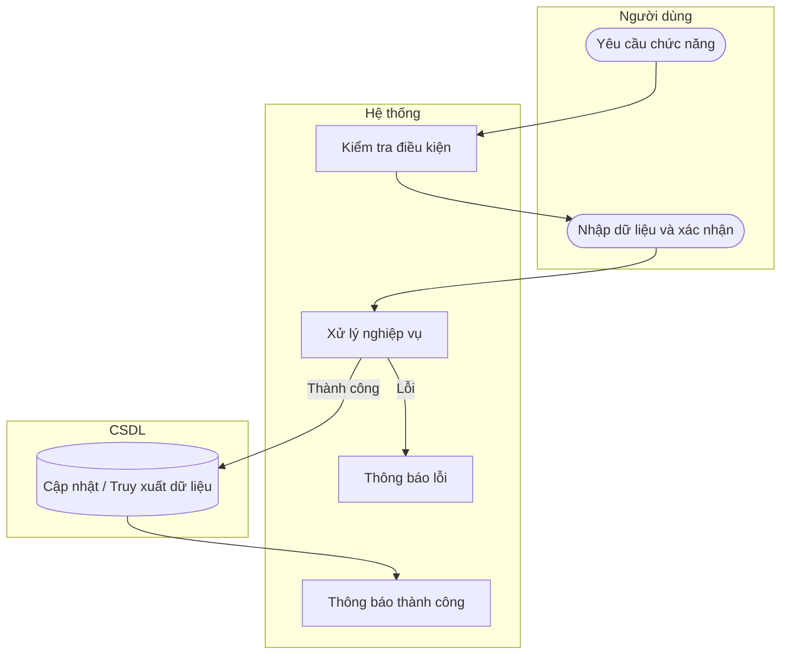

# UC48 — Cập nhật trạng thái nhà cung cấp

| Thành phần | Nội dung |
|:---|:---|
| **Tên Use-case** | Cập nhật trạng thái nhà cung cấp |
| **Mô tả** | Khóa hồ sơ đối tác khi tiệm ngừng hợp tác, đảm bảo không bị mất thông tin liên hệ trong các phiếu nhập kho đã lập trước đó. |
| **Actors** | Thủ kho, Quản lý |
| **Tiền điều kiện** | Đã chọn nhà cung cấp. |
| **Hậu điều kiện** | Trạng thái nhà cung cấp được cập nhật. |

## Luồng sự kiện chính

1. Người dùng chọn thay đổi trạng thái nhà cung cấp.
2. Hệ thống yêu cầu xác nhận.
3. Người dùng xác nhận.
4. Hệ thống cập nhật trạng thái vô hiệu hóa.
5. Hệ thống thông báo thành công.

## Luồng sự kiện lỗi

- Không có ngoại lệ đặc biệt.

## Activity Diagram

