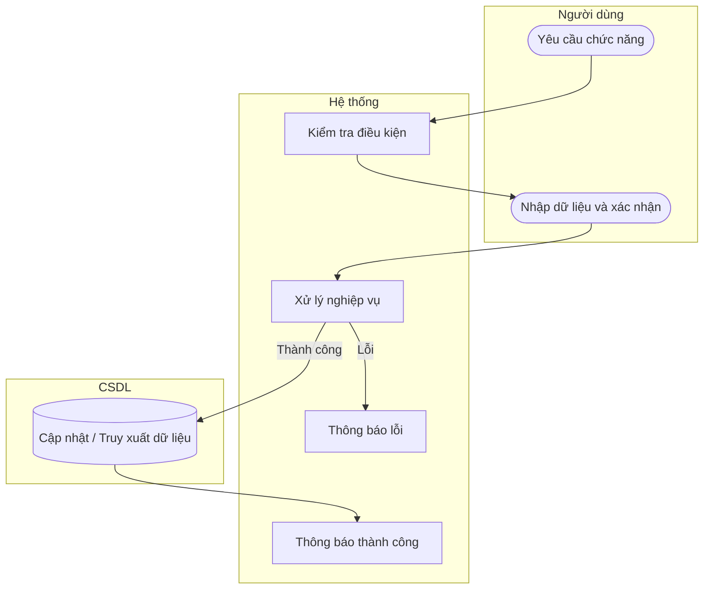

# UC49 — Tra cứu nhà cung cấp

| Thành phần | Nội dung |
|:---|:---|
| **Tên Use-case** | Tra cứu nhà cung cấp |
| **Mô tả** | Tìm kiếm và xem thông tin chi tiết của các nhà cung cấp để phục vụ việc liên hệ đặt hàng hoặc truy vết sự cố nguyên liệu. |
| **Actors** | Thủ kho, Quản lý |
| **Tiền điều kiện** | Đã đăng nhập hệ thống. |
| **Hậu điều kiện** | Hiển thị thông tin tìm kiếm. |

## Luồng sự kiện chính

1. Người dùng nhập từ khóa vào ô tìm kiếm.
2. Hệ thống truy vấn cơ sở dữ liệu.
3. Hệ thống hiển thị danh sách kết quả phù hợp.

## Luồng sự kiện lỗi

- Không có ngoại lệ đặc biệt.

## Activity Diagram

