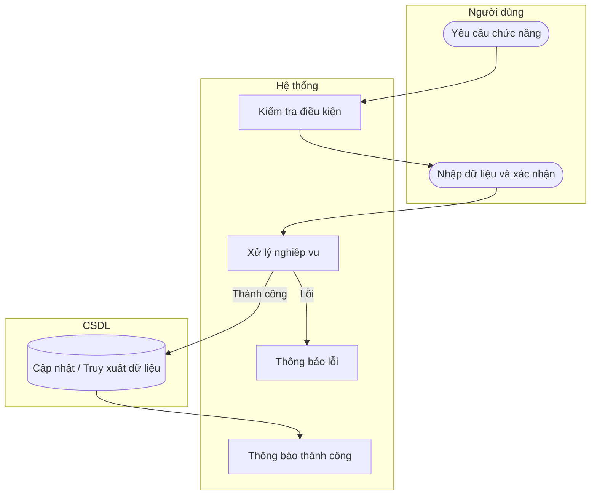

# UC50 — Báo cáo lợi nhuận

| Thành phần | Nội dung |
|:---|:---|
| **Tên Use-case** | Báo cáo lợi nhuận |
| **Mô tả** | Tính lợi nhuận dựa trên giá vốn và đơn giá bán. |
| **Actors** | Quản lý |
| **Tiền điều kiện** | Đã đăng nhập quyền Quản lý. |
| **Hậu điều kiện** | Báo cáo lợi nhuận hiển thị dưới dạng bảng hoặc biểu đồ. |

## Luồng sự kiện chính

1. Quản lý chọn xem báo cáo lợi nhuận.
2. Quản lý chọn khoảng thời gian cần xem.
3. Hệ thống tổng hợp doanh thu và giá vốn.
4. Hệ thống tính toán lợi nhuận và hiển thị báo cáo.

## Luồng sự kiện lỗi

- Không có ngoại lệ đặc biệt.

## Activity Diagram

