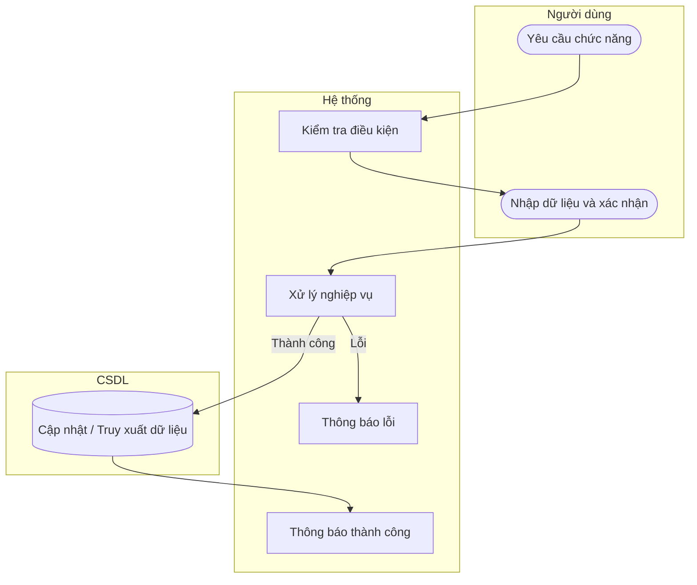

# UC51 — Báo cáo doanh thu

| Thành phần | Nội dung |
|:---|:---|
| **Tên Use-case** | Báo cáo doanh thu |
| **Mô tả** | Thống kê số tiền thu được theo ca, ngày, tháng, năm và biểu đồ xu hướng. |
| **Actors** | Quản lý |
| **Tiền điều kiện** | Đã đăng nhập quyền Quản lý. |
| **Hậu điều kiện** | Báo cáo doanh thu hiển thị. |

## Luồng sự kiện chính

1. Quản lý chọn xem báo cáo doanh thu.
2. Quản lý thiết lập tiêu chí (thời gian, ca).
3. Hệ thống truy xuất dữ liệu hóa đơn.
4. Hệ thống vẽ biểu đồ và hiển thị tổng doanh thu.

## Luồng sự kiện lỗi

- Không có ngoại lệ đặc biệt.

## Activity Diagram

