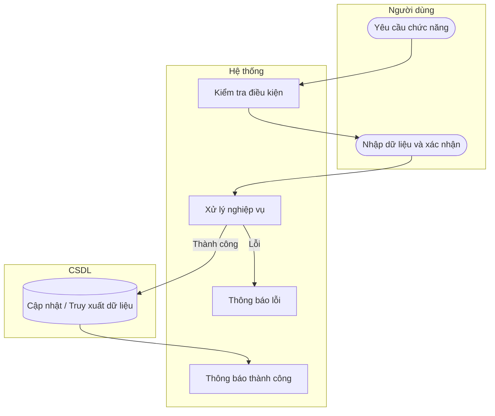

# UC52 — Báo cáo tồn kho

| Thành phần | Nội dung |
|:---|:---|
| **Tên Use-case** | Báo cáo tồn kho |
| **Mô tả** | Tổng hợp số lượng nguyên liệu đầu kỳ, nhập, xuất và tồn cuối kỳ. |
| **Actors** | Quản lý, Thủ kho |
| **Tiền điều kiện** | Đã đăng nhập hệ thống. |
| **Hậu điều kiện** | Báo cáo tồn kho hiển thị. |

## Luồng sự kiện chính

1. Người dùng chọn xem báo cáo tồn kho.
2. Người dùng chọn tháng hoặc khoảng thời gian.
3. Hệ thống tổng hợp dữ liệu thẻ kho.
4. Hệ thống hiển thị kết quả báo cáo.

## Luồng sự kiện lỗi

- Không có ngoại lệ đặc biệt.

## Activity Diagram

