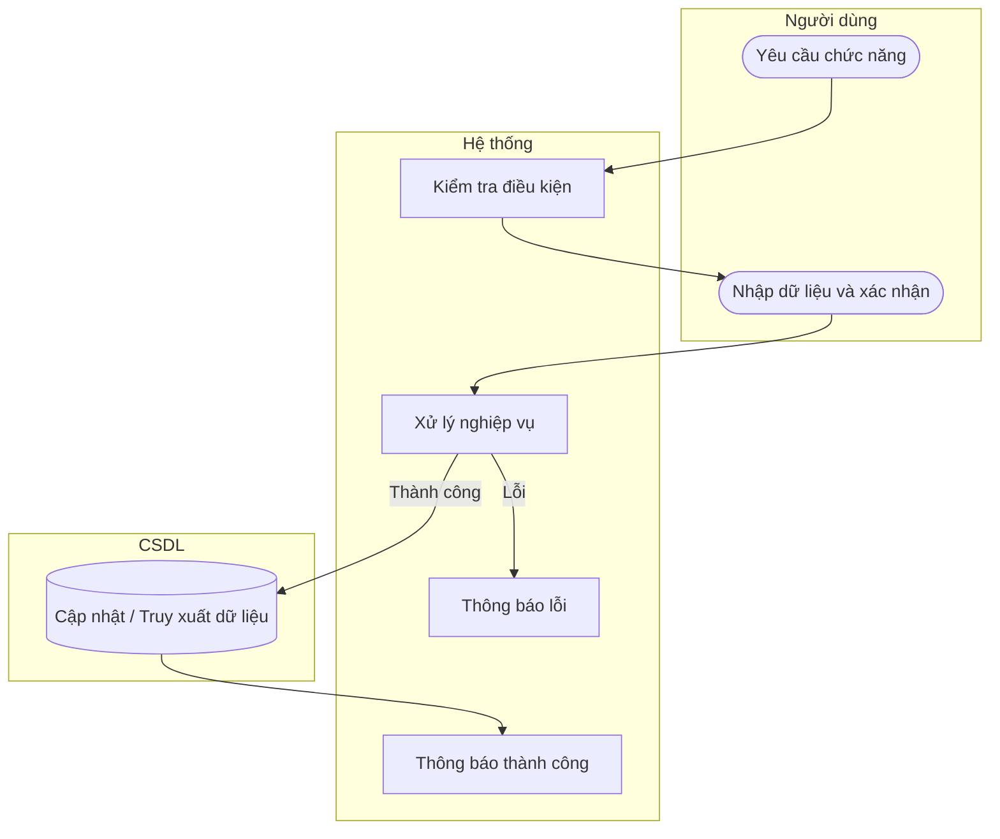

# UC53 — Thêm loại thu chi

| Thành phần | Nội dung |
|:---|:---|
| **Tên Use-case** | Thêm loại thu chi |
| **Mô tả** | Tạo mới một hạng mục lý do thu chi để phân loại dòng tiền minh bạch. |
| **Actors** | Quản lý |
| **Tiền điều kiện** | Đã đăng nhập quyền Quản lý. |
| **Hậu điều kiện** | Hạng mục thu chi mới được tạo. |

## Luồng sự kiện chính

1. Quản lý chọn thêm loại thu chi.
2. Quản lý nhập tên và phân loại (Thu/Chi).
3. Quản lý nhấn lưu.
4. Hệ thống kiểm tra và lưu vào danh mục.
5. Hệ thống thông báo thành công.

## Luồng sự kiện lỗi

- Không có ngoại lệ đặc biệt.

## Activity Diagram

