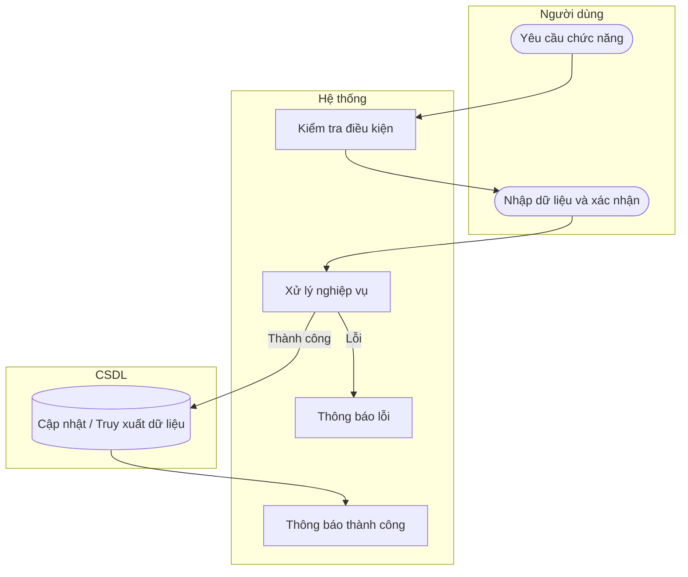

# UC54 — Sửa loại thu chi

| Thành phần | Nội dung |
|:---|:---|
| **Tên Use-case** | Sửa loại thu chi |
| **Mô tả** | Chỉnh sửa tên gọi hoặc nội dung mô tả của một hạng mục thu chi hiện tại. |
| **Actors** | Quản lý |
| **Tiền điều kiện** | Đã chọn hạng mục cần sửa. |
| **Hậu điều kiện** | Hạng mục được cập nhật. |

## Luồng sự kiện chính

1. Quản lý chọn sửa thông tin loại thu chi.
2. Hệ thống hiển thị thông tin.
3. Quản lý thay đổi và lưu.
4. Hệ thống lưu thay đổi và thông báo thành công.

## Luồng sự kiện lỗi

- Không có ngoại lệ đặc biệt.

## Activity Diagram

