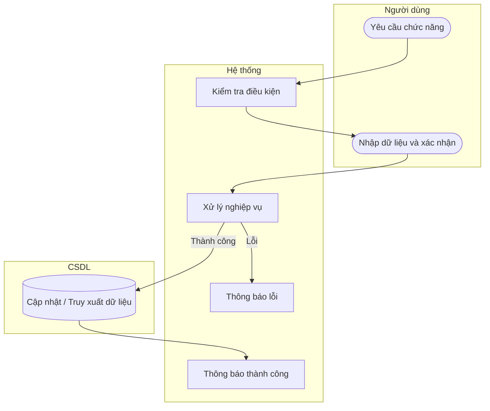

# UC55 — Cập nhật trạng thái loại thu chi

| Thành phần | Nội dung |
|:---|:---|
| **Tên Use-case** | Cập nhật trạng thái loại thu chi |
| **Mô tả** | Thao tác vô hiệu hóa hoặc kích hoạt lại danh mục thu chi, giúp ẩn hoặc hiện danh mục khi lập phiếu mới mà vẫn bảo toàn toàn vẹn dữ liệu lịch sử. |
| **Actors** | Quản lý |
| **Tiền điều kiện** | Đã chọn hạng mục. |
| **Hậu điều kiện** | Trạng thái hạng mục được cập nhật. |

## Luồng sự kiện chính

1. Quản lý chọn thay đổi trạng thái hạng mục thu chi.
2. Hệ thống yêu cầu xác nhận.
3. Quản lý xác nhận.
4. Hệ thống vô hiệu hóa (hoặc kích hoạt) hạng mục.
5. Hệ thống thông báo thành công.

## Luồng sự kiện lỗi

- Không có ngoại lệ đặc biệt.

## Activity Diagram

