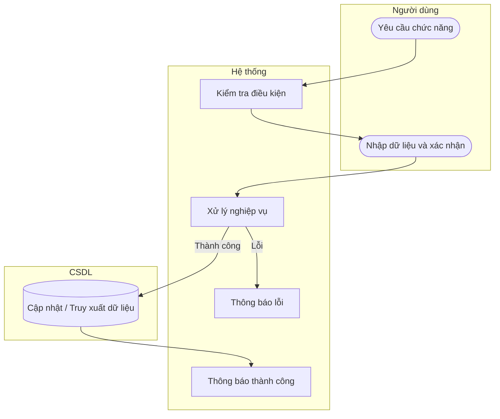

# UC57 — Hủy phiếu thu chi

| Thành phần | Nội dung |
|:---|:---|
| **Tên Use-case** | Hủy phiếu thu chi |
| **Mô tả** | Vô hiệu hóa các phiếu thu chi bị lập sai, hệ thống tự động hoàn tác dòng tiền và tính toán lại số dư tồn quỹ thực tế. |
| **Actors** | Quản lý |
| **Tiền điều kiện** | Phiếu thu chi tồn tại và chưa bị hủy. |
| **Hậu điều kiện** | Phiếu thu chi bị vô hiệu hóa, quỹ được hoàn tác. |

## Luồng sự kiện chính

1. Quản lý chọn phiếu thu chi cần hủy.
2. Quản lý chọn chức năng hủy phiếu.
3. Hệ thống yêu cầu xác nhận lý do.
4. Quản lý nhập lý do và xác nhận.
5. Hệ thống đảo ngược giao dịch và cập nhật quỹ.
6. Hệ thống thông báo hủy thành công.

## Luồng sự kiện lỗi

- Không có ngoại lệ đặc biệt.

## Activity Diagram

